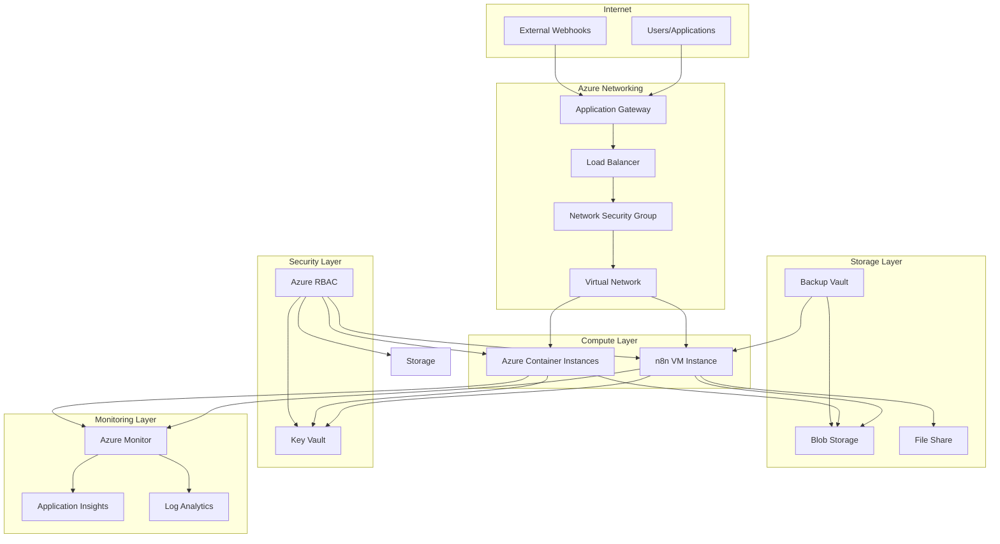

# Azure Infrastructure Operations Guide

## Table of Contents

1. [Architecture Overview](#architecture-overview)
2. [Infrastructure Components](#infrastructure-components)
3. [Deployment Procedures](#deployment-procedures)
4. [Security & Compliance](#security--compliance)
5. [Monitoring & Logging](#monitoring--logging)
6. [Backup & Disaster Recovery](#backup--disaster-recovery)
7. [Operational Procedures](#operational-procedures)
8. [Troubleshooting Guide](#troubleshooting-guide)
9. [Cost Management](#cost-management)
10. [Appendices](#appendices)

---

## Architecture Overview

This section provides a high-level overview of the Azure infrastructure supporting the School Automation n8n workflows system. The architecture is designed for reliability, security, and scalability.

### High-Level Architecture

The system consists of multiple Azure services working together to host, secure, monitor, and protect the n8n automation platform:



### Component Relationships

#### Compute Layer
- **Virtual Machines**: Primary deployment option for n8n, providing full control and customization
- **Azure Container Instances**: Alternative lightweight deployment option for containerized n8n instances

#### Storage Layer
- **Blob Storage**: Stores workflow backups, exported JSON files, and static assets
- **File Share**: Provides persistent storage for n8n data directory and workflow files
- **Backup Vault**: Centralized backup repository for VM snapshots and storage backups

#### Security Layer
- **Azure Key Vault**: Securely stores and manages:
  - Google OAuth2 credentials
  - SMTP server credentials
  - Telegram bot tokens
  - API keys and secrets
- **Azure RBAC**: Controls access to Azure resources and services

#### Networking Layer
- **Virtual Network (VNet)**: Isolated network environment for compute resources
- **Network Security Groups (NSG)**: Firewall rules controlling inbound/outbound traffic
- **Load Balancer**: Distributes traffic across multiple instances (if using scale-out)
- **Application Gateway**: Provides application-level routing and SSL termination

#### Monitoring Layer
- **Azure Monitor**: Collects metrics and logs from all Azure resources
- **Application Insights**: Application performance monitoring for n8n workflows
- **Log Analytics**: Centralized log aggregation and analysis

### Data Flow

1. **Inbound Requests**: External webhooks and user requests enter through Application Gateway
2. **Traffic Routing**: Load Balancer distributes traffic to available n8n instances
3. **Workflow Execution**: n8n processes workflows, accessing credentials from Key Vault
4. **Data Persistence**: Workflow data and backups stored in Blob Storage and File Share
5. **Monitoring**: All activities logged to Azure Monitor and Application Insights
6. **Backup**: Scheduled backups stored in Backup Vault

### Network Topology

```
Internet
  │
  ├─ Application Gateway (Public IP)
  │   └─ SSL/TLS Termination
  │
  ├─ Load Balancer (Internal)
  │   └─ Traffic Distribution
  │
  └─ Virtual Network (10.0.0.0/16)
      ├─ Subnet: Compute (10.0.1.0/24)
      │   ├─ n8n VM (10.0.1.4)
      │   └─ Container Instances (10.0.1.5-10.0.1.10)
      │
      ├─ Subnet: Gateway (10.0.2.0/24)
      │   └─ Application Gateway
      │
      └─ Subnet: Storage (10.0.3.0/24)
          └─ Private Endpoints for Storage/Key Vault
```

### Design Principles

1. **High Availability**: Multiple compute instances with load balancing
2. **Security First**: All secrets in Key Vault, network isolation via VNet
3. **Scalability**: Can scale compute resources based on demand
4. **Observability**: Comprehensive monitoring and logging
5. **Disaster Recovery**: Automated backups with defined RTO/RPO
6. **Cost Optimization**: Right-sized resources with reserved instances where applicable

---

## Infrastructure Components

This section details each Azure service component, including configuration requirements, sizing recommendations, and operational considerations.

### Virtual Machines

#### Overview
Virtual Machines provide the primary compute platform for hosting n8n. This option offers full control over the operating system and application configuration.

#### Recommended VM Sizes

| Workload Size | VM Size | vCPUs | RAM | Use Case |
|--------------|---------|-------|-----|----------|
| Small (< 50 workflows) | Standard_B2s | 2 | 4 GB | Development/Testing |
| Medium (50-200 workflows) | Standard_B4ms | 4 | 16 GB | Production (Single Instance) |
| Large (200-500 workflows) | Standard_D4s_v3 | 4 | 16 GB | Production (High Performance) |
| Enterprise (> 500 workflows) | Standard_D8s_v3 | 8 | 32 GB | Production (Scale-Out) |

#### VM Configuration

**Operating System:**
- **Recommended**: Ubuntu Server 22.04 LTS
- **Alternative**: Windows Server 2022 (if required)

**Disk Configuration:**
- **OS Disk**: Premium SSD (P10 - 128 GB minimum)
- **Data Disk**: Premium SSD (P20 - 256 GB) for n8n data directory
- **Backup Disk**: Standard HDD (S10 - 128 GB) for local backups

**Network Interface:**
- Attach to VNet subnet (Compute subnet)
- Assign static private IP address
- Configure NSG rules (see Networking section)

#### n8n Installation on VM

```bash
# Install Node.js (n8n requires Node.js 18+)
curl -fsSL https://deb.nodesource.com/setup_20.x | sudo -E bash -
sudo apt-get install -y nodejs

# Install n8n globally
sudo npm install n8n -g

# Create systemd service
sudo nano /etc/systemd/system/n8n.service
```

**Systemd Service Configuration:**
```ini
[Unit]
Description=n8n workflow automation
After=network.target

[Service]
Type=simple
User=n8n
Environment=N8N_BASIC_AUTH_ACTIVE=true
Environment=N8N_BASIC_AUTH_USER=admin
Environment=N8N_BASIC_AUTH_PASSWORD=<from-key-vault>
Environment=N8N_HOST=0.0.0.0
Environment=N8N_PORT=5678
Environment=N8N_PROTOCOL=https
Environment=NODE_ENV=production
ExecStart=/usr/bin/n8n start
Restart=always
RestartSec=10

[Install]
WantedBy=multi-user.target
```

#### VM Management

**Start/Stop VM:**
```bash
# Azure CLI
az vm start --resource-group <rg-name> --name <vm-name>
az vm stop --resource-group <rg-name> --name <vm-name>
az vm deallocate --resource-group <rg-name> --name <vm-name>
```

**SSH Access:**
```bash
# Using Azure Bastion (recommended)
az vm show --resource-group <rg-name> --name <vm-name> --show-details --query publicIps

# Or configure SSH key
az vm create --resource-group <rg-name> --name <vm-name> --generate-ssh-keys
```

### Azure Container Instances

#### Overview
Azure Container Instances (ACI) provides a serverless container platform for running n8n without managing VMs. Ideal for development, testing, or lightweight production workloads.

#### Container Configuration

**Docker Image:**
- Official: `n8nio/n8n:latest` or specific version tag
- Custom: Build with additional tools/plugins

**Container Specifications:**

| Workload | CPU | Memory | Use Case |
|----------|-----|--------|----------|
| Small | 1.0 | 2 GB | Development |
| Medium | 2.0 | 4 GB | Production (Single) |
| Large | 4.0 | 8 GB | Production (High Load) |

#### ACI Deployment

**Azure CLI:**
```bash
az container create \
  --resource-group <rg-name> \
  --name n8n-instance \
  --image n8nio/n8n:latest \
  --cpu 2 \
  --memory 4 \
  --ports 5678 \
  --environment-variables \
    N8N_BASIC_AUTH_ACTIVE=true \
    N8N_BASIC_AUTH_USER=admin \
    N8N_PROTOCOL=https \
  --secure-environment-variables \
    N8N_BASIC_AUTH_PASSWORD=<from-key-vault> \
  --azure-file-volume-share-name n8n-data \
  --azure-file-volume-account-name <storage-account> \
  --azure-file-volume-account-key <storage-key> \
  --azure-file-volume-mount-path /home/node/.n8n \
  --dns-name-label n8n-<unique-name> \
  --location <region>
```

**YAML Configuration:**
```yaml
apiVersion: 2019-12-01
location: <region>
name: n8n-instance
properties:
  containers:
  - name: n8n
    properties:
      image: n8nio/n8n:latest
      resources:
        requests:
          cpu: 2
          memoryInGb: 4
      ports:
      - port: 5678
        protocol: TCP
      environmentVariables:
      - name: N8N_BASIC_AUTH_ACTIVE
        value: "true"
      - name: N8N_PROTOCOL
        value: "https"
      volumeMounts:
      - name: n8n-data
        mountPath: /home/node/.n8n
  volumes:
  - name: n8n-data
    azureFile:
      shareName: n8n-data
      storageAccountName: <storage-account>
      storageAccountKey: <storage-key>
  osType: Linux
  ipAddress:
    type: Public
    ports:
    - protocol: TCP
      port: 5678
    dnsNameLabel: n8n-<unique-name>
```

#### ACI vs VM Decision Matrix

| Factor | VM | ACI |
|--------|----|-----|
| Control | Full OS control | Container only |
| Startup Time | 2-5 minutes | 30-60 seconds |
| Cost | Higher (always running) | Pay per second |
| Persistence | Native disk | Requires Azure Files |
| Scaling | Manual/Autoscale | Manual restart |
| Best For | Production, complex setup | Dev/Test, simple deployments |

### Azure Storage

#### Blob Storage

**Purpose:**
- Workflow backup storage (JSON exports)
- Static asset storage
- Log file archival
- Disaster recovery backups

**Storage Account Configuration:**

```bash
# Create storage account
az storage account create \
  --resource-group <rg-name> \
  --name <storage-account-name> \
  --location <region> \
  --sku Standard_LRS \
  --kind StorageV2 \
  --access-tier Hot \
  --https-only true \
  --min-tls-version TLS1_2
```

**Container Structure:**
```
storage-account/
├── workflows/
│   ├── backups/
│   │   ├── daily/
│   │   ├── weekly/
│   │   └── monthly/
│   └── exports/
├── logs/
│   ├── application/
│   └── audit/
└── assets/
    └── static-files/
```

**Access Configuration:**
- **Private Access**: Use private endpoints for secure access
- **Blob Access**: SAS tokens for temporary access
- **Lifecycle Management**: Configure policies to move old backups to Archive tier

**Lifecycle Policy Example:**
```json
{
  "rules": [
    {
      "name": "BackupLifecycle",
      "enabled": true,
      "type": "Lifecycle",
      "definition": {
        "filters": {
          "blobTypes": ["blockBlob"],
          "prefixMatch": ["workflows/backups/"]
        },
        "actions": {
          "baseBlob": {
            "tierToCool": {
              "daysAfterModificationGreaterThan": 30
            },
            "tierToArchive": {
              "daysAfterModificationGreaterThan": 90
            },
            "delete": {
              "daysAfterModificationGreaterThan": 365
            }
          }
        }
      }
    }
  ]
}
```

#### Azure Files

**Purpose:**
- Persistent storage for n8n data directory
- Shared storage for container instances
- Mount point for VM data disks

**File Share Configuration:**

```bash
# Create file share
az storage share create \
  --account-name <storage-account> \
  --name n8n-data \
  --quota 100
```

**Mount Configuration (Linux VM):**
```bash
# Install cifs-utils
sudo apt-get install cifs-utils

# Create mount point
sudo mkdir /mnt/n8n-data

# Mount file share
sudo mount -t cifs //<storage-account>.file.core.windows.net/n8n-data /mnt/n8n-data \
  -o vers=3.0,username=<storage-account>,password=<storage-key>,dir_mode=0777,file_mode=0777

# Add to /etc/fstab for persistent mount
echo "//<storage-account>.file.core.windows.net/n8n-data /mnt/n8n-data cifs vers=3.0,username=<storage-account>,password=<storage-key>,dir_mode=0777,file_mode=0777 0 0" | sudo tee -a /etc/fstab
```

**Performance Tiers:**

| Tier | IOPS | Throughput | Use Case |
|------|------|------------|----------|
| Standard (HDD) | 1,000 | 60 MiB/s | Low frequency access |
| Premium (SSD) | 5,000 | 300 MiB/s | High performance workloads |

### Azure Key Vault

#### Overview
Azure Key Vault securely stores and manages secrets, keys, and certificates used by n8n workflows.

#### Secret Management

**Stored Secrets:**
- Google OAuth2 Client ID and Secret
- Google OAuth2 Refresh Token
- SMTP server credentials (username, password, host, port)
- Telegram Bot API Token
- Telegram Chat ID
- n8n Basic Auth credentials
- Database connection strings (if applicable)
- API keys for external services

#### Key Vault Setup

```bash
# Create Key Vault
az keyvault create \
  --resource-group <rg-name> \
  --name <keyvault-name> \
  --location <region> \
  --sku standard \
  --enable-purge-protection true \
  --enable-soft-delete true
```

**Access Policies:**
```bash
# Grant VM managed identity access
az keyvault set-policy \
  --name <keyvault-name> \
  --object-id <vm-identity-id> \
  --secret-permissions get list

# Grant ACI access (if using service principal)
az keyvault set-policy \
  --name <keyvault-name> \
  --spn <service-principal-id> \
  --secret-permissions get list
```

#### Adding Secrets

```bash
# Add Google OAuth credentials
az keyvault secret set \
  --vault-name <keyvault-name> \
  --name "GoogleOAuthClientId" \
  --value "<client-id>"

az keyvault secret set \
  --vault-name <keyvault-name> \
  --name "GoogleOAuthClientSecret" \
  --value "<client-secret>"

# Add SMTP credentials
az keyvault secret set \
  --vault-name <keyvault-name> \
  --name "SMTPHost" \
  --value "smtp.gmail.com"

az keyvault secret set \
  --vault-name <keyvault-name> \
  --name "SMTPUsername" \
  --value "<email>"

az keyvault secret set \
  --vault-name <keyvault-name> \
  --name "SMTPPassword" \
  --value "<password>"

# Add Telegram token
az keyvault secret set \
  --vault-name <keyvault-name> \
  --name "TelegramBotToken" \
  --value "<bot-token>"
```

#### Retrieving Secrets in n8n

**Using Azure CLI (VM):**
```bash
# Install Azure CLI on VM
curl -sL https://aka.ms/InstallAzureCLIDeb | sudo bash

# Login with managed identity
az login --identity

# Retrieve secret
SECRET=$(az keyvault secret show \
  --vault-name <keyvault-name> \
  --name "GoogleOAuthClientId" \
  --query value -o tsv)
```

**Using REST API (Application):**
```bash
# Get access token
TOKEN=$(curl -s 'http://169.254.169.254/metadata/identity/oauth2/token?api-version=2018-02-01&resource=https://vault.azure.net' -H Metadata:true | jq -r .access_token)

# Retrieve secret
curl -s "https://<keyvault-name>.vault.azure.net/secrets/GoogleOAuthClientId?api-version=7.3" \
  -H "Authorization: Bearer $TOKEN" | jq -r .value
```

### Networking

#### Virtual Network (VNet)

**VNet Configuration:**
```bash
# Create VNet
az network vnet create \
  --resource-group <rg-name> \
  --name school-automation-vnet \
  --address-prefix 10.0.0.0/16 \
  --location <region>
```

**Subnet Configuration:**
```bash
# Compute subnet
az network vnet subnet create \
  --resource-group <rg-name> \
  --vnet-name school-automation-vnet \
  --name compute-subnet \
  --address-prefix 10.0.1.0/24

# Gateway subnet
az network vnet subnet create \
  --resource-group <rg-name> \
  --vnet-name school-automation-vnet \
  --name gateway-subnet \
  --address-prefix 10.0.2.0/24

# Storage subnet (for private endpoints)
az network vnet subnet create \
  --resource-group <rg-name> \
  --vnet-name school-automation-vnet \
  --name storage-subnet \
  --address-prefix 10.0.3.0/24
```

#### Network Security Groups (NSG)

**NSG Rules for n8n VM:**

```bash
# Create NSG
az network nsg create \
  --resource-group <rg-name> \
  --name n8n-nsg

# Allow HTTPS from Application Gateway
az network nsg rule create \
  --resource-group <rg-name> \
  --nsg-name n8n-nsg \
  --name Allow-HTTPS-From-AGW \
  --priority 100 \
  --source-address-prefixes 10.0.2.0/24 \
  --source-port-ranges '*' \
  --destination-address-prefixes '*' \
  --destination-port-ranges 5678 \
  --access Allow \
  --protocol Tcp \
  --description "Allow HTTPS from Application Gateway"

# Allow SSH from Bastion
az network nsg rule create \
  --resource-group <rg-name> \
  --nsg-name n8n-nsg \
  --name Allow-SSH-From-Bastion \
  --priority 200 \
  --source-address-prefixes 10.0.2.4/32 \
  --source-port-ranges '*' \
  --destination-address-prefixes '*' \
  --destination-port-ranges 22 \
  --access Allow \
  --protocol Tcp \
  --description "Allow SSH from Azure Bastion"

# Deny all other inbound
az network nsg rule create \
  --resource-group <rg-name> \
  --nsg-name n8n-nsg \
  --name Deny-All-Inbound \
  --priority 4000 \
  --source-address-prefixes '*' \
  --source-port-ranges '*' \
  --destination-address-prefixes '*' \
  --destination-port-ranges '*' \
  --access Deny \
  --protocol '*' \
  --description "Deny all other inbound traffic"
```

**Outbound Rules:**
```bash
# Allow outbound HTTPS
az network nsg rule create \
  --resource-group <rg-name> \
  --nsg-name n8n-nsg \
  --name Allow-Outbound-HTTPS \
  --priority 100 \
  --direction Outbound \
  --source-address-prefixes '*' \
  --source-port-ranges '*' \
  --destination-address-prefixes '*' \
  --destination-port-ranges 443 \
  --access Allow \
  --protocol Tcp

# Allow outbound DNS
az network nsg rule create \
  --resource-group <rg-name> \
  --nsg-name n8n-nsg \
  --name Allow-Outbound-DNS \
  --priority 200 \
  --direction Outbound \
  --source-address-prefixes '*' \
  --source-port-ranges '*' \
  --destination-address-prefixes 168.63.129.16 \
  --destination-port-ranges 53 \
  --access Allow \
  --protocol Udp
```

#### Private Endpoints

**Storage Private Endpoint:**
```bash
# Create private endpoint for storage
az network private-endpoint create \
  --resource-group <rg-name> \
  --name storage-private-endpoint \
  --vnet-name school-automation-vnet \
  --subnet storage-subnet \
  --private-connection-resource-id /subscriptions/<sub-id>/resourceGroups/<rg-name>/providers/Microsoft.Storage/storageAccounts/<storage-account> \
  --group-id file \
  --connection-name storage-connection
```

**Key Vault Private Endpoint:**
```bash
# Create private endpoint for Key Vault
az network private-endpoint create \
  --resource-group <rg-name> \
  --name keyvault-private-endpoint \
  --vnet-name school-automation-vnet \
  --subnet storage-subnet \
  --private-connection-resource-id /subscriptions/<sub-id>/resourceGroups/<rg-name>/providers/Microsoft.KeyVault/vaults/<keyvault-name> \
  --group-id vault \
  --connection-name keyvault-connection
```

### Azure Backup

#### Backup Configuration

**Recovery Services Vault:**
```bash
# Create Recovery Services Vault
az backup vault create \
  --resource-group <rg-name> \
  --name school-automation-backup-vault \
  --location <region>
```

**VM Backup Policy:**
```bash
# Create backup policy
az backup policy create \
  --resource-group <rg-name> \
  --vault-name school-automation-backup-vault \
  --name DailyBackupPolicy \
  --backup-management-type AzureIaasVM \
  --policy-type V1 \
  --workload-type VM \
  --schedule-run-time 02:00 \
  --schedule-run-days Monday Tuesday Wednesday Thursday Friday Saturday Sunday \
  --retention-duration 30 \
  --retention-schedule-daily \
  --retention-duration-count 30
```

**Enable VM Backup:**
```bash
# Enable backup for VM
az backup protection enable-for-vm \
  --resource-group <rg-name> \
  --vault-name school-automation-backup-vault \
  --vm <vm-name> \
  --policy-name DailyBackupPolicy
```

**Storage Account Backup:**
```bash
# Enable backup for storage account (using Azure Backup for Blobs)
az backup protection enable-for-azurestorageblob \
  --resource-group <rg-name> \
  --vault-name school-automation-backup-vault \
  --storage-account <storage-account> \
  --container-name workflows \
  --backup-management-type AzureStorage
```

#### Backup Retention

| Backup Type | Retention Period | Frequency |
|------------|------------------|-----------|
| VM Snapshots | 30 days | Daily |
| Blob Storage | 90 days | Daily |
| File Share | 30 days | Daily |
| Key Vault | 90 days | Daily (soft delete) |

#### Backup Verification

**Test Restore Procedure:**
1. Create test resource group
2. Restore VM to test environment
3. Verify n8n functionality
4. Clean up test resources

```bash
# List recovery points
az backup recoverypoint list \
  --resource-group <rg-name> \
  --vault-name school-automation-backup-vault \
  --container-name <vm-container> \
  --item-name <vm-name>
```

---

## Deployment Procedures

This section provides step-by-step procedures for deploying the Azure infrastructure and n8n application.

### Prerequisites

Before beginning deployment, ensure you have:

- Azure subscription with appropriate permissions (Owner or Contributor)
- Azure CLI installed and configured (`az login`)
- Access to Azure Portal
- n8n workflow JSON files ready for import
- Google OAuth credentials (if using Google Sheets/Calendar)
- SMTP server credentials
- Telegram bot token (optional)

### Initial Infrastructure Setup

#### Step 1: Create Resource Group

```bash
# Set variables
RESOURCE_GROUP="school-automation-rg"
LOCATION="eastus"

# Create resource group
az group create \
  --name $RESOURCE_GROUP \
  --location $LOCATION
```

#### Step 2: Create Storage Account

```bash
STORAGE_ACCOUNT="schoolautomation$(date +%s)"

az storage account create \
  --resource-group $RESOURCE_GROUP \
  --name $STORAGE_ACCOUNT \
  --location $LOCATION \
  --sku Standard_LRS \
  --kind StorageV2 \
  --access-tier Hot \
  --https-only true \
  --min-tls-version TLS1_2

# Create containers and file shares
az storage container create \
  --account-name $STORAGE_ACCOUNT \
  --name workflows

az storage share create \
  --account-name $STORAGE_ACCOUNT \
  --name n8n-data \
  --quota 100
```

#### Step 3: Create Key Vault

```bash
KEYVAULT_NAME="school-automation-kv-$(date +%s | cut -c1-8)"

az keyvault create \
  --resource-group $RESOURCE_GROUP \
  --name $KEYVAULT_NAME \
  --location $LOCATION \
  --sku standard \
  --enable-purge-protection true \
  --enable-soft-delete true

# Add secrets (replace with actual values)
az keyvault secret set \
  --vault-name $KEYVAULT_NAME \
  --name "GoogleOAuthClientId" \
  --value "<your-client-id>"

az keyvault secret set \
  --vault-name $KEYVAULT_NAME \
  --name "GoogleOAuthClientSecret" \
  --value "<your-client-secret>"

az keyvault secret set \
  --vault-name $KEYVAULT_NAME \
  --name "SMTPHost" \
  --value "smtp.gmail.com"

az keyvault secret set \
  --vault-name $KEYVAULT_NAME \
  --name "SMTPUsername" \
  --value "<your-email>"

az keyvault secret set \
  --vault-name $KEYVAULT_NAME \
  --name "SMTPPassword" \
  --value "<your-password>"
```

#### Step 4: Create Virtual Network

```bash
# Create VNet
az network vnet create \
  --resource-group $RESOURCE_GROUP \
  --name school-automation-vnet \
  --address-prefix 10.0.0.0/16 \
  --location $LOCATION

# Create subnets
az network vnet subnet create \
  --resource-group $RESOURCE_GROUP \
  --vnet-name school-automation-vnet \
  --name compute-subnet \
  --address-prefix 10.0.1.0/24

az network vnet subnet create \
  --resource-group $RESOURCE_GROUP \
  --vnet-name school-automation-vnet \
  --name gateway-subnet \
  --address-prefix 10.0.2.0/24

az network vnet subnet create \
  --resource-group $RESOURCE_GROUP \
  --vnet-name school-automation-vnet \
  --name storage-subnet \
  --address-prefix 10.0.3.0/24
```

#### Step 5: Create Network Security Group

```bash
# Create NSG
az network nsg create \
  --resource-group $RESOURCE_GROUP \
  --name n8n-nsg \
  --location $LOCATION

# Add rules (see Networking section for details)
az network nsg rule create \
  --resource-group $RESOURCE_GROUP \
  --nsg-name n8n-nsg \
  --name Allow-HTTPS-From-AGW \
  --priority 100 \
  --source-address-prefixes 10.0.2.0/24 \
  --source-port-ranges '*' \
  --destination-address-prefixes '*' \
  --destination-port-ranges 5678 \
  --access Allow \
  --protocol Tcp
```

### n8n Deployment Options

#### Option A: Deploy on Virtual Machine

##### Step 1: Create VM

```bash
VM_NAME="n8n-vm"
VM_SIZE="Standard_B4ms"
VM_IMAGE="Ubuntu2204"

# Create public IP (temporary, will be removed after AGW setup)
az network public-ip create \
  --resource-group $RESOURCE_GROUP \
  --name n8n-vm-pip \
  --allocation-method Static

# Create network interface
az network nic create \
  --resource-group $RESOURCE_GROUP \
  --name n8n-vm-nic \
  --vnet-name school-automation-vnet \
  --subnet compute-subnet \
  --network-security-group n8n-nsg \
  --public-ip-address n8n-vm-pip

# Create VM
az vm create \
  --resource-group $RESOURCE_GROUP \
  --name $VM_NAME \
  --image $VM_IMAGE \
  --size $VM_SIZE \
  --nics n8n-vm-nic \
  --admin-username azureuser \
  --generate-ssh-keys \
  --os-disk-size-gb 128 \
  --data-disk-sizes-gb 256
```

##### Step 2: Enable Managed Identity

```bash
# Enable system-assigned managed identity
az vm identity assign \
  --resource-group $RESOURCE_GROUP \
  --name $VM_NAME

# Get identity principal ID
IDENTITY_ID=$(az vm identity show \
  --resource-group $RESOURCE_GROUP \
  --name $VM_NAME \
  --query principalId -o tsv)

# Grant Key Vault access
az keyvault set-policy \
  --name $KEYVAULT_NAME \
  --object-id $IDENTITY_ID \
  --secret-permissions get list
```

##### Step 3: Install n8n on VM

```bash
# Get VM public IP
VM_IP=$(az vm show -d \
  --resource-group $RESOURCE_GROUP \
  --name $VM_NAME \
  --query publicIps -o tsv)

# SSH into VM
ssh azureuser@$VM_IP

# On VM, run installation script
cat << 'EOF' > install-n8n.sh
#!/bin/bash

# Update system
sudo apt-get update
sudo apt-get upgrade -y

# Install Node.js
curl -fsSL https://deb.nodesource.com/setup_20.x | sudo -E bash -
sudo apt-get install -y nodejs

# Install n8n
sudo npm install n8n -g

# Install Azure CLI
curl -sL https://aka.ms/InstallAzureCLIDeb | sudo bash

# Create n8n user
sudo useradd -m -s /bin/bash n8n

# Create data directory
sudo mkdir -p /home/n8n/.n8n
sudo chown n8n:n8n /home/n8n/.n8n

# Install cifs-utils for Azure Files
sudo apt-get install -y cifs-utils

# Mount Azure File Share (replace with actual values)
STORAGE_ACCOUNT="<storage-account>"
STORAGE_KEY="<storage-key>"
sudo mkdir -p /mnt/n8n-data
sudo mount -t cifs //$STORAGE_ACCOUNT.file.core.windows.net/n8n-data /mnt/n8n-data \
  -o vers=3.0,username=$STORAGE_ACCOUNT,password=$STORAGE_KEY,dir_mode=0777,file_mode=0777

# Create systemd service
sudo tee /etc/systemd/system/n8n.service > /dev/null << 'SERVICE_EOF'
[Unit]
Description=n8n workflow automation
After=network.target

[Service]
Type=simple
User=n8n
Environment=N8N_BASIC_AUTH_ACTIVE=true
Environment=N8N_BASIC_AUTH_USER=admin
Environment=N8N_HOST=0.0.0.0
Environment=N8N_PORT=5678
Environment=N8N_PROTOCOL=https
Environment=NODE_ENV=production
ExecStart=/usr/bin/n8n start
Restart=always
RestartSec=10

[Install]
WantedBy=multi-user.target
SERVICE_EOF

# Enable and start service
sudo systemctl daemon-reload
sudo systemctl enable n8n
sudo systemctl start n8n

# Check status
sudo systemctl status n8n
EOF

chmod +x install-n8n.sh
./install-n8n.sh
```

##### Step 4: Configure n8n Environment Variables

```bash
# On VM, create script to retrieve secrets from Key Vault
cat << 'EOF' > /home/n8n/load-secrets.sh
#!/bin/bash

KEYVAULT_NAME="<keyvault-name>"

# Login with managed identity
az login --identity

# Retrieve secrets
export GOOGLE_OAUTH_CLIENT_ID=$(az keyvault secret show \
  --vault-name $KEYVAULT_NAME \
  --name "GoogleOAuthClientId" \
  --query value -o tsv)

export GOOGLE_OAUTH_CLIENT_SECRET=$(az keyvault secret show \
  --vault-name $KEYVAULT_NAME \
  --name "GoogleOAuthClientSecret" \
  --query value -o tsv)

export SMTP_HOST=$(az keyvault secret show \
  --vault-name $KEYVAULT_NAME \
  --name "SMTPHost" \
  --query value -o tsv)

export SMTP_USER=$(az keyvault secret show \
  --vault-name $KEYVAULT_NAME \
  --name "SMTPUsername" \
  --query value -o tsv)

export SMTP_PASS=$(az keyvault secret show \
  --vault-name $KEYVAULT_NAME \
  --name "SMTPPassword" \
  --query value -o tsv)
EOF

chmod +x /home/n8n/load-secrets.sh
```

#### Option B: Deploy on Azure Container Instances

##### Step 1: Get Storage Account Key

```bash
STORAGE_KEY=$(az storage account keys list \
  --resource-group $RESOURCE_GROUP \
  --account-name $STORAGE_ACCOUNT \
  --query "[0].value" -o tsv)
```

##### Step 2: Create Container Instance

```bash
ACI_NAME="n8n-instance"

az container create \
  --resource-group $RESOURCE_GROUP \
  --name $ACI_NAME \
  --image n8nio/n8n:latest \
  --cpu 2 \
  --memory 4 \
  --ports 5678 \
  --dns-name-label n8n-$(date +%s | cut -c1-8) \
  --location $LOCATION \
  --environment-variables \
    N8N_BASIC_AUTH_ACTIVE=true \
    N8N_BASIC_AUTH_USER=admin \
    N8N_PROTOCOL=https \
    N8N_HOST=0.0.0.0 \
    N8N_PORT=5678 \
  --secure-environment-variables \
    N8N_BASIC_AUTH_PASSWORD="<set-password>" \
  --azure-file-volume-share-name n8n-data \
  --azure-file-volume-account-name $STORAGE_ACCOUNT \
  --azure-file-volume-account-key $STORAGE_KEY \
  --azure-file-volume-mount-path /home/node/.n8n
```

### Post-Deployment Configuration

#### Step 1: Import Workflows

1. Access n8n interface:
   - VM: `https://<vm-ip>:5678`
   - ACI: `https://<dns-label>.<region>.azurecontainer.io:5678`

2. Login with basic auth credentials

3. Import workflows:
   - Go to Workflows → Import from File
   - Import each JSON file from the project

4. Configure each workflow:
   - Update Google Sheet IDs
   - Configure credentials (Google OAuth, SMTP, Telegram)
   - Test workflow execution

#### Step 2: Configure Application Gateway (Optional)

For production deployments, set up Application Gateway for SSL termination and load balancing:

```bash
# Create public IP for Application Gateway
az network public-ip create \
  --resource-group $RESOURCE_GROUP \
  --name agw-pip \
  --allocation-method Static \
  --sku Standard

# Create Application Gateway
az network application-gateway create \
  --resource-group $RESOURCE_GROUP \
  --name school-automation-agw \
  --location $LOCATION \
  --vnet-name school-automation-vnet \
  --subnet gateway-subnet \
  --public-ip-address agw-pip \
  --frontend-port 443 \
  --backend-pool-name n8n-backend \
  --backend-servers <vm-private-ip> \
  --http-settings-cookie-based-affinity Enabled \
  --http-settings-port 5678 \
  --http-settings-protocol Http \
  --sku Standard_v2 \
  --capacity 2
```

#### Step 3: Set Up Monitoring

See Monitoring & Logging section for detailed setup instructions.

#### Step 4: Configure Backups

```bash
# Create Recovery Services Vault
az backup vault create \
  --resource-group $RESOURCE_GROUP \
  --name school-automation-backup-vault \
  --location $LOCATION

# Create backup policy
az backup policy create \
  --resource-group $RESOURCE_GROUP \
  --vault-name school-automation-backup-vault \
  --name DailyBackupPolicy \
  --backup-management-type AzureIaasVM \
  --policy-type V1 \
  --workload-type VM \
  --schedule-run-time 02:00 \
  --schedule-run-days Monday Tuesday Wednesday Thursday Friday Saturday Sunday \
  --retention-duration 30

# Enable backup for VM
az backup protection enable-for-vm \
  --resource-group $RESOURCE_GROUP \
  --vault-name school-automation-backup-vault \
  --vm $VM_NAME \
  --policy-name DailyBackupPolicy
```

### Verification Checklist

After deployment, verify:

- [ ] n8n is accessible and running
- [ ] All workflows imported successfully
- [ ] Google Sheets integration working
- [ ] SMTP email sending working
- [ ] Telegram notifications working (if configured)
- [ ] Key Vault secrets accessible
- [ ] Storage account accessible
- [ ] Backups configured and running
- [ ] Monitoring alerts configured
- [ ] Network security rules applied
- [ ] SSL/TLS certificates configured (if using Application Gateway)

### Troubleshooting Deployment Issues

**VM not accessible:**
- Check NSG rules
- Verify VM is running
- Check network interface configuration

**n8n not starting:**
- Check systemd service status: `sudo systemctl status n8n`
- Review logs: `sudo journalctl -u n8n -f`
- Verify Node.js installation: `node --version`
- Check port availability: `sudo netstat -tlnp | grep 5678`

**Key Vault access denied:**
- Verify managed identity is assigned
- Check Key Vault access policies
- Verify identity has correct permissions

**Storage mount failed:**
- Verify storage account key
- Check network connectivity
- Verify cifs-utils installed
- Check firewall rules on storage account

---

## Security & Compliance

This section covers security best practices, compliance requirements, and identity management for the School Automation infrastructure.

### Identity and Access Management (RBAC)

#### Role-Based Access Control

**Recommended Roles:**

| Role | Scope | Purpose |
|------|-------|---------|
| Owner | Resource Group | Full access (use sparingly) |
| Contributor | Resource Group | Manage resources (deployment) |
| Reader | Resource Group | Read-only access (monitoring) |
| Key Vault Secrets User | Key Vault | Read secrets (application) |
| Storage Blob Data Contributor | Storage Account | Read/write blobs |
| Virtual Machine Contributor | VM | Manage VM operations |

#### Assigning Roles

```bash
# Get user/principal ID
USER_PRINCIPAL="<user-email-or-object-id>"

# Assign Contributor role to resource group
az role assignment create \
  --assignee $USER_PRINCIPAL \
  --role "Contributor" \
  --scope /subscriptions/<sub-id>/resourceGroups/<rg-name>

# Assign Key Vault Secrets User to application
az role assignment create \
  --assignee $IDENTITY_ID \
  --role "Key Vault Secrets User" \
  --scope /subscriptions/<sub-id>/resourceGroups/<rg-name>/providers/Microsoft.KeyVault/vaults/<keyvault-name>
```

#### Managed Identities

**System-Assigned Managed Identity (Recommended for VMs):**

```bash
# Enable on VM
az vm identity assign \
  --resource-group <rg-name> \
  --name <vm-name>

# Grant Key Vault access
IDENTITY_ID=$(az vm identity show \
  --resource-group <rg-name> \
  --name <vm-name> \
  --query principalId -o tsv)

az keyvault set-policy \
  --name <keyvault-name> \
  --object-id $IDENTITY_ID \
  --secret-permissions get list
```

**User-Assigned Managed Identity (For multiple resources):**

```bash
# Create user-assigned identity
az identity create \
  --resource-group <rg-name> \
  --name n8n-managed-identity

# Assign to VM
az vm identity assign \
  --resource-group <rg-name> \
  --name <vm-name> \
  --identities <identity-resource-id>
```

### Network Security

#### Network Security Groups (NSG)

**Inbound Rules:**

| Priority | Name | Source | Port | Protocol | Action | Purpose |
|----------|------|--------|------|----------|--------|---------|
| 100 | Allow-HTTPS-From-AGW | 10.0.2.0/24 | 5678 | TCP | Allow | Application Gateway |
| 200 | Allow-SSH-From-Bastion | 10.0.2.4/32 | 22 | TCP | Allow | Azure Bastion |
| 300 | Allow-Monitoring | 168.63.129.16 | 443 | TCP | Allow | Azure Monitor |
| 4000 | Deny-All-Inbound | * | * | * | Deny | Default deny |

**Outbound Rules:**

| Priority | Name | Destination | Port | Protocol | Action | Purpose |
|----------|------|-------------|------|----------|--------|---------|
| 100 | Allow-Outbound-HTTPS | * | 443 | TCP | Allow | External APIs |
| 200 | Allow-Outbound-DNS | 168.63.129.16 | 53 | UDP | Allow | DNS resolution |
| 300 | Allow-KeyVault | <keyvault-ip> | 443 | TCP | Allow | Key Vault access |
| 400 | Allow-Storage | <storage-ip> | 443 | TCP | Allow | Storage access |
| 4000 | Deny-All-Outbound | * | * | * | Deny | Default deny |

#### Application Security Groups (ASG)

For more granular control, use Application Security Groups:

```bash
# Create ASG for n8n instances
az network asg create \
  --resource-group <rg-name> \
  --name n8n-asg

# Associate with network interface
az network nic ip-config update \
  --resource-group <rg-name> \
  --nic-name <nic-name> \
  --name ipconfig1 \
  --application-security-groups n8n-asg
```

#### Azure Firewall (Optional)

For enterprise deployments, consider Azure Firewall:

```bash
# Create Azure Firewall
az network firewall create \
  --resource-group <rg-name> \
  --name school-automation-fw \
  --location <region>

# Create firewall policy
az network firewall policy create \
  --resource-group <rg-name> \
  --name fw-policy

# Add application rule for n8n webhooks
az network firewall policy rule-collection-group create \
  --resource-group <rg-name> \
  --policy-name fw-policy \
  --name default \
  --priority 100

az network firewall policy rule-collection-group collection add-filter-collection \
  --resource-group <rg-name> \
  --policy-name fw-policy \
  --rule-collection-group-name default \
  --name allow-n8n-webhooks \
  --collection-priority 100 \
  --action Allow \
  --rule-name allow-https \
  --rule-type ApplicationRule \
  --source-addresses 10.0.1.0/24 \
  --protocols Https=443 \
  --target-fqdns "*.googleapis.com" "api.telegram.org"
```

### Key Vault Security

#### Access Policies

**Principle of Least Privilege:**

```bash
# Grant only necessary permissions
az keyvault set-policy \
  --name <keyvault-name> \
  --object-id <identity-id> \
  --secret-permissions get list \
  --key-permissions get \
  --certificate-permissions get
```

#### Key Vault Firewall

Enable Key Vault firewall for additional security:

```bash
# Enable firewall
az keyvault update \
  --name <keyvault-name> \
  --resource-group <rg-name> \
  --default-action Deny

# Allow access from VNet
az keyvault network-rule add \
  --name <keyvault-name> \
  --resource-group <rg-name> \
  --vnet-name school-automation-vnet \
  --subnet storage-subnet

# Allow access from specific IPs (for management)
az keyvault network-rule add \
  --name <keyvault-name> \
  --resource-group <rg-name> \
  --ip-address <admin-ip>
```

#### Private Endpoints

Use private endpoints to access Key Vault securely:

```bash
# Create private endpoint
az network private-endpoint create \
  --resource-group <rg-name> \
  --name keyvault-pe \
  --vnet-name school-automation-vnet \
  --subnet storage-subnet \
  --private-connection-resource-id /subscriptions/<sub-id>/resourceGroups/<rg-name>/providers/Microsoft.KeyVault/vaults/<keyvault-name> \
  --group-id vault \
  --connection-name keyvault-connection

# Disable public network access
az keyvault update \
  --name <keyvault-name> \
  --resource-group <rg-name> \
  --public-network-access Disabled
```

### Data Encryption

#### Encryption at Rest

**Storage Account Encryption:**

```bash
# Enable encryption (enabled by default)
az storage account update \
  --name <storage-account> \
  --resource-group <rg-name> \
  --encryption-services blob file \
  --encryption-key-source Microsoft.Storage
```

**VM Disk Encryption:**

```bash
# Enable Azure Disk Encryption
az vm encryption enable \
  --resource-group <rg-name> \
  --name <vm-name> \
  --disk-encryption-keyvault <keyvault-name> \
  --key-encryption-key <key-name> \
  --volume-type All
```

#### Encryption in Transit

**TLS Configuration:**

- Minimum TLS version: 1.2
- Use HTTPS for all external communications
- Configure Application Gateway with SSL certificates
- Enable HSTS headers

**Storage Account TLS:**

```bash
# Enforce minimum TLS version
az storage account update \
  --name <storage-account> \
  --resource-group <rg-name> \
  --min-tls-version TLS1_2 \
  --https-only true
```

### Compliance Considerations

#### FERPA (Family Educational Rights and Privacy Act)

**Requirements:**
- Student data must be protected
- Access controls and audit logging
- Data retention policies
- Breach notification procedures

**Implementation:**
- Enable audit logging on all data access
- Implement role-based access controls
- Encrypt student data at rest and in transit
- Maintain access logs for compliance audits
- Implement data retention policies in storage lifecycle management

#### GDPR (General Data Protection Regulation)

**Requirements:**
- Right to access personal data
- Right to erasure (data deletion)
- Data portability
- Privacy by design

**Implementation:**
- Implement data export functionality
- Create procedures for data deletion requests
- Document data processing activities
- Implement consent management
- Regular security assessments

#### Audit Logging

**Enable Diagnostic Settings:**

```bash
# Enable Key Vault logging
az monitor diagnostic-settings create \
  --resource <keyvault-resource-id> \
  --name keyvault-diagnostics \
  --workspace <log-analytics-workspace-id> \
  --logs '[{"category":"AuditEvent","enabled":true}]'

# Enable Storage Account logging
az monitor diagnostic-settings create \
  --resource <storage-resource-id> \
  --name storage-diagnostics \
  --workspace <log-analytics-workspace-id> \
  --logs '[{"category":"StorageRead","enabled":true},{"category":"StorageWrite","enabled":true}]'

# Enable VM logging
az monitor diagnostic-settings create \
  --resource <vm-resource-id> \
  --name vm-diagnostics \
  --workspace <log-analytics-workspace-id> \
  --logs '[{"category":"VmInstanceView","enabled":true}]' \
  --metrics '[{"category":"AllMetrics","enabled":true}]'
```

### Security Best Practices Checklist

**Identity & Access:**
- [ ] Use managed identities instead of service principals
- [ ] Implement least privilege access (RBAC)
- [ ] Enable MFA for administrative accounts
- [ ] Regularly review and audit role assignments
- [ ] Use separate accounts for different environments

**Network Security:**
- [ ] All resources in private VNet
- [ ] NSG rules configured with least privilege
- [ ] Private endpoints for Key Vault and Storage
- [ ] No public IPs on VMs (use Application Gateway)
- [ ] Azure Bastion for VM access

**Data Protection:**
- [ ] All secrets in Key Vault
- [ ] Encryption at rest enabled
- [ ] TLS 1.2+ for all connections
- [ ] Regular backup encryption
- [ ] Secure key rotation procedures

**Monitoring & Compliance:**
- [ ] Diagnostic logging enabled on all resources
- [ ] Security alerts configured
- [ ] Regular security assessments
- [ ] Compliance documentation maintained
- [ ] Incident response plan documented

### Security Incident Response

**Incident Response Procedure:**

1. **Detection**: Monitor Azure Security Center alerts
2. **Containment**: Isolate affected resources
3. **Investigation**: Review logs and audit trails
4. **Remediation**: Apply security patches or configuration changes
5. **Recovery**: Restore services from backups if needed
6. **Documentation**: Document incident and lessons learned

**Security Contacts:**

```bash
# Set security contact email
az security contact create \
  --email security-team@school.com \
  --alert-notifications On \
  --alerts-admins On
```

### Regular Security Tasks

**Weekly:**
- Review Azure Security Center recommendations
- Check for failed authentication attempts
- Review Key Vault access logs

**Monthly:**
- Audit RBAC assignments
- Review NSG rules
- Check for security updates
- Review compliance status

**Quarterly:**
- Security assessment and penetration testing
- Review and update security policies
- Compliance audit
- Disaster recovery testing

---

## Monitoring & Logging

This section covers monitoring setup, log aggregation, alerting, and dashboard configuration for operational visibility.

### Azure Monitor Overview

Azure Monitor provides comprehensive monitoring capabilities including metrics, logs, and alerts for all Azure resources.

#### Log Analytics Workspace

**Create Workspace:**

```bash
# Create Log Analytics workspace
az monitor log-analytics workspace create \
  --resource-group <rg-name> \
  --name school-automation-workspace \
  --location <region>
```

**Get Workspace ID:**

```bash
WORKSPACE_ID=$(az monitor log-analytics workspace show \
  --resource-group <rg-name> \
  --name school-automation-workspace \
  --query customerId -o tsv)

WORKSPACE_KEY=$(az monitor log-analytics workspace get-shared-keys \
  --resource-group <rg-name> \
  --name school-automation-workspace \
  --query primarySharedKey -o tsv)
```

### Application Insights

Application Insights provides application performance monitoring (APM) for n8n workflows.

#### Setup Application Insights

```bash
# Create Application Insights resource
az monitor app-insights component create \
  --app school-automation-n8n \
  --location <region> \
  --resource-group <rg-name> \
  --application-type web

# Get instrumentation key
INSTRUMENTATION_KEY=$(az monitor app-insights component show \
  --app school-automation-n8n \
  --resource-group <rg-name> \
  --query instrumentationKey -o tsv)
```

#### Configure n8n for Application Insights

**On VM, install Application Insights agent:**

```bash
# Install Node.js Application Insights SDK
sudo npm install -g applicationinsights

# Configure environment variable
sudo systemctl edit n8n.service
```

Add to service file:
```ini
[Service]
Environment="APPLICATIONINSIGHTS_CONNECTION_STRING=InstrumentationKey=<instrumentation-key>"
```

### Diagnostic Settings

#### Enable Diagnostics for All Resources

**Key Vault Diagnostics:**

```bash
az monitor diagnostic-settings create \
  --resource /subscriptions/<sub-id>/resourceGroups/<rg-name>/providers/Microsoft.KeyVault/vaults/<keyvault-name> \
  --name keyvault-diagnostics \
  --workspace <log-analytics-workspace-id> \
  --logs '[{"category":"AuditEvent","enabled":true,"retentionPolicy":{"enabled":true,"days":90}}]' \
  --metrics '[{"category":"AllMetrics","enabled":true,"retentionPolicy":{"enabled":true,"days":30}}]'
```

**Storage Account Diagnostics:**

```bash
az monitor diagnostic-settings create \
  --resource /subscriptions/<sub-id>/resourceGroups/<rg-name>/providers/Microsoft.Storage/storageAccounts/<storage-account> \
  --name storage-diagnostics \
  --workspace <log-analytics-workspace-id> \
  --logs '[{"category":"StorageRead","enabled":true},{"category":"StorageWrite","enabled":true},{"category":"StorageDelete","enabled":true}]' \
  --metrics '[{"category":"Transaction","enabled":true}]'
```

**Virtual Machine Diagnostics:**

```bash
# Enable VM diagnostics extension
az vm extension set \
  --resource-group <rg-name> \
  --vm-name <vm-name> \
  --name LinuxDiagnostic \
  --publisher Microsoft.Azure.Diagnostics \
  --settings '{
    "StorageAccount": "<storage-account>",
    "ladCfg": {
      "diagnosticMonitorConfiguration": {
        "eventVolume": "Medium",
        "metrics": {
          "resourceId": "/subscriptions/<sub-id>/resourceGroups/<rg-name>/providers/Microsoft.Compute/virtualMachines/<vm-name>",
          "metricAggregation": [{"scheduledTransferPeriod": "PT1H"}]
        },
        "performanceCounters": {
          "sinks": "MyMetricEventHub,MyJsonMetricsBlob",
          "performanceCounterConfiguration": [
            {
              "unit": "Percent",
              "type": "builtin",
              "counter": "PercentProcessorTime",
              "counterSpecifier": "/builtin/Processor/PercentProcessorTime",
              "condition": "IsAggregate=TRUE"
            }
          ]
        }
      }
    }
  }'
```

### Custom Metrics and Logs

#### n8n Application Logs

**Configure n8n to send logs to Log Analytics:**

```bash
# On VM, install OMS agent (if not using VM extension)
wget https://raw.githubusercontent.com/Microsoft/OMS-Agent-for-Linux/master/installer/scripts/onboard_agent.sh
sudo sh onboard_agent.sh -w <workspace-id> -s <workspace-key>

# Configure n8n logs collection
sudo tee /etc/opt/microsoft/omsagent/<workspace-id>/conf/omsagent.d/n8n.conf > /dev/null << 'EOF'
<source>
  type tail
  path /var/log/n8n/n8n.log
  pos_file /var/log/n8n/n8n.log.pos
  tag n8n
  format json
</source>

<match n8n.**>
  type out_oms_api
  log_level info
  num_threads 5
  omsadmin_conf_path /etc/opt/microsoft/omsagent/<workspace-id>/conf/omsadmin.conf
</match>
EOF
```

### Alert Rules

#### Critical Alerts

**VM Availability Alert:**

```bash
az monitor metrics alert create \
  --name "VM-Availability-Alert" \
  --resource-group <rg-name> \
  --scopes /subscriptions/<sub-id>/resourceGroups/<rg-name>/providers/Microsoft.Compute/virtualMachines/<vm-name> \
  --condition "avg Percentage CPU > 90" \
  --window-size 5m \
  --evaluation-frequency 1m \
  --action-group <action-group-id> \
  --description "Alert when VM CPU exceeds 90%"
```

**Disk Space Alert:**

```bash
az monitor metrics alert create \
  --name "VM-Disk-Space-Alert" \
  --resource-group <rg-name> \
  --scopes /subscriptions/<sub-id>/resourceGroups/<rg-name>/providers/Microsoft.Compute/virtualMachines/<vm-name> \
  --condition "avg Percentage CPU > 0" \
  --window-size 5m \
  --evaluation-frequency 1m \
  --action-group <action-group-id>
```

**Key Vault Access Alert (Log Alert):**

```bash
# Create action group first
az monitor action-group create \
  --resource-group <rg-name> \
  --name security-alerts \
  --short-name sec-alert \
  --email-receivers name=SecurityTeam email=security@school.com

# Create log alert rule
az monitor scheduled-query create \
  --resource-group <rg-name> \
  --name "KeyVault-Unauthorized-Access" \
  --scopes /subscriptions/<sub-id>/resourceGroups/<rg-name>/providers/Microsoft.OperationalInsights/workspaces/<workspace-name> \
  --condition "count 'AuditEvent | where OperationName == \"VaultGet\" and ResultType == \"Unauthorized\"' > 0" \
  --window-size 5m \
  --evaluation-frequency 1m \
  --action-group <action-group-id>
```

**n8n Service Down Alert:**

```bash
# Create log query alert for n8n service failure
az monitor scheduled-query create \
  --resource-group <rg-name> \
  --name "n8n-Service-Down" \
  --scopes /subscriptions/<sub-id>/resourceGroups/<rg-name>/providers/Microsoft.OperationalInsights/workspaces/<workspace-name> \
  --condition "count 'Syslog | where Facility == \"daemon\" and Message contains \"n8n\" and Message contains \"failed\"' > 0" \
  --window-size 5m \
  --evaluation-frequency 1m \
  --action-group <action-group-id>
```

#### Action Groups

**Create Action Group:**

```bash
az monitor action-group create \
  --resource-group <rg-name> \
  --name n8n-alerts \
  --short-name n8n \
  --email-receivers \
    name=OperationsTeam email=ops@school.com \
    name=OnCallEngineer email=oncall@school.com \
  --sms-receivers \
    name=OnCallSMS country-code=1 phone-number=1234567890 \
  --webhook-receivers \
    name=SlackWebhook uri=https://hooks.slack.com/services/YOUR/WEBHOOK/URL
```

### Dashboards

#### Create Operational Dashboard

**Using Azure Portal:**

1. Navigate to Azure Portal → Dashboards
2. Create new dashboard: "School Automation Operations"
3. Add tiles:
   - VM CPU and Memory metrics
   - Storage account usage
   - Key Vault access logs
   - n8n workflow execution status
   - Recent alerts
   - Cost summary

**Using Azure CLI (ARM Template):**

```bash
# Export dashboard template from portal, then deploy
az deployment group create \
  --resource-group <rg-name> \
  --template-file dashboard-template.json
```

#### KQL Queries for Common Scenarios

**VM Performance:**

```kusto
Perf
| where Computer == "<vm-name>" and TimeGenerated > ago(1h)
| where CounterName == "% Processor Time" or CounterName == "Available MBytes"
| summarize avg(CounterValue) by CounterName, bin(TimeGenerated, 5m)
| render timechart
```

**n8n Workflow Execution:**

```kusto
Syslog
| where Facility == "daemon" and Message contains "n8n"
| where TimeGenerated > ago(24h)
| summarize count() by bin(TimeGenerated, 1h)
| render timechart
```

**Key Vault Access Patterns:**

```kusto
AzureDiagnostics
| where ResourceProvider == "MICROSOFT.KEYVAULT"
| where Category == "AuditEvent"
| summarize count() by OperationName, bin(TimeGenerated, 1h)
| render timechart
```

**Storage Account Activity:**

```kusto
StorageBlobLogs
| where TimeGenerated > ago(24h)
| summarize count() by OperationName, bin(TimeGenerated, 1h)
| render timechart
```

### Log Retention

**Configure Retention Policies:**

```bash
# Set workspace retention to 90 days
az monitor log-analytics workspace update \
  --resource-group <rg-name> \
  --name school-automation-workspace \
  --retention-time 90
```

**Archive Old Logs:**

- Use Azure Data Lake Storage for long-term archival
- Configure lifecycle management for cost optimization
- Export critical logs to external SIEM if required

### Monitoring Best Practices

**Metrics to Monitor:**

1. **VM Metrics:**
   - CPU utilization (threshold: 80%)
   - Memory usage (threshold: 85%)
   - Disk I/O (threshold: 80% of IOPS limit)
   - Network throughput

2. **Application Metrics:**
   - n8n workflow execution time
   - Failed workflow count
   - Active workflow count
   - API response times

3. **Storage Metrics:**
   - Storage account capacity
   - Blob storage growth rate
   - File share usage

4. **Security Metrics:**
   - Failed authentication attempts
   - Key Vault access patterns
   - Network security rule hits

**Alert Thresholds:**

| Metric | Warning | Critical | Action |
|--------|---------|----------|--------|
| VM CPU | 70% | 90% | Scale up or optimize |
| VM Memory | 80% | 95% | Add memory or scale |
| Disk Space | 80% | 90% | Clean up or expand |
| Failed Workflows | 5/hour | 20/hour | Investigate errors |
| Key Vault Errors | 1/hour | 5/hour | Check credentials |

### Integration with External Tools

#### Export to SIEM

**Configure Log Export:**

```bash
# Create event hub for log export
az eventhubs namespace create \
  --resource-group <rg-name> \
  --name school-automation-logs \
  --location <region>

# Configure diagnostic setting to export to event hub
az monitor diagnostic-settings create \
  --resource <resource-id> \
  --name export-to-eventhub \
  --event-hub <eventhub-name> \
  --logs '[{"category":"AllLogs","enabled":true}]'
```

#### Power BI Integration

Export Log Analytics data to Power BI for advanced analytics and reporting.

---

## Backup & Disaster Recovery

This section covers backup strategies, recovery procedures, and disaster recovery planning for the School Automation infrastructure.

### Recovery Objectives

**Recovery Time Objective (RTO):**
- **Critical Workflows**: 4 hours
- **Standard Workflows**: 24 hours
- **Development/Test**: 48 hours

**Recovery Point Objective (RPO):**
- **Critical Workflows**: 1 hour (hourly backups)
- **Standard Workflows**: 24 hours (daily backups)
- **Development/Test**: 7 days (weekly backups)

### Backup Strategy

#### Multi-Tier Backup Approach

1. **Tier 1 - VM Snapshots**: Full system state (daily)
2. **Tier 2 - Workflow Backups**: n8n workflow JSON exports (hourly/daily)
3. **Tier 3 - Storage Backups**: Blob and file share backups (daily)
4. **Tier 4 - Configuration Backups**: Infrastructure as Code (version controlled)

### Azure Backup Configuration

#### Recovery Services Vault

**Create Vault:**

```bash
# Create Recovery Services Vault
az backup vault create \
  --resource-group <rg-name> \
  --name school-automation-backup-vault \
  --location <region> \
  --storage-redundancy GeoRedundant
```

#### VM Backup Policy

**Create Daily Backup Policy:**

```bash
az backup policy create \
  --resource-group <rg-name> \
  --vault-name school-automation-backup-vault \
  --name DailyBackupPolicy \
  --backup-management-type AzureIaasVM \
  --policy-type V1 \
  --workload-type VM \
  --schedule-run-time 02:00 \
  --schedule-run-days Monday Tuesday Wednesday Thursday Friday Saturday Sunday \
  --retention-duration 30 \
  --retention-schedule-daily \
  --retention-duration-count 30
```

**Create Weekly Backup Policy:**

```bash
az backup policy create \
  --resource-group <rg-name> \
  --vault-name school-automation-backup-vault \
  --name WeeklyBackupPolicy \
  --backup-management-type AzureIaasVM \
  --policy-type V1 \
  --workload-type VM \
  --schedule-run-time 02:00 \
  --schedule-run-days Sunday \
  --retention-duration 90 \
  --retention-schedule-weekly \
  --retention-duration-count 12 \
  --retention-weekday Sunday
```

**Enable VM Backup:**

```bash
# Enable backup for VM
az backup protection enable-for-vm \
  --resource-group <rg-name> \
  --vault-name school-automation-backup-vault \
  --vm <vm-name> \
  --policy-name DailyBackupPolicy
```

#### Storage Account Backup

**Blob Backup:**

```bash
# Enable blob backup
az backup protection enable-for-azurestorageblob \
  --resource-group <rg-name> \
  --vault-name school-automation-backup-vault \
  --storage-account <storage-account> \
  --container-name workflows \
  --backup-management-type AzureStorage
```

**File Share Backup:**

```bash
# Enable file share backup
az backup protection enable-for-azurefileshare \
  --resource-group <rg-name> \
  --vault-name school-automation-backup-vault \
  --storage-account <storage-account> \
  --file-share-name n8n-data \
  --backup-management-type AzureStorage \
  --policy-name FileShareBackupPolicy
```

### n8n Workflow Backups

#### Automated Workflow Export

**Create Backup Script:**

```bash
# On VM, create backup script
cat << 'EOF' > /home/n8n/backup-workflows.sh
#!/bin/bash

BACKUP_DIR="/mnt/n8n-data/backups"
DATE=$(date +%Y%m%d_%H%M%S)
BACKUP_FILE="$BACKUP_DIR/workflows_$DATE.json"

# Create backup directory
mkdir -p $BACKUP_DIR

# Export all workflows using n8n CLI or API
# Option 1: Using n8n API
curl -X GET "http://localhost:5678/api/v1/workflows" \
  -u "admin:$(az keyvault secret show --vault-name <keyvault-name> --name N8nBasicAuthPassword --query value -o tsv)" \
  -o $BACKUP_FILE

# Compress backup
gzip $BACKUP_FILE

# Upload to blob storage
az storage blob upload \
  --account-name <storage-account> \
  --container-name workflows \
  --name "backups/daily/workflows_$DATE.json.gz" \
  --file "$BACKUP_FILE.gz"

# Clean up local backup (keep last 7 days)
find $BACKUP_DIR -name "workflows_*.json.gz" -mtime +7 -delete

echo "Backup completed: workflows_$DATE.json.gz"
EOF

chmod +x /home/n8n/backup-workflows.sh
```

**Schedule with Cron:**

```bash
# Add to crontab for hourly backups
(crontab -l 2>/dev/null; echo "0 * * * * /home/n8n/backup-workflows.sh >> /var/log/n8n-backup.log 2>&1") | crontab -
```

#### Manual Workflow Backup

**Using n8n UI:**
1. Navigate to n8n interface
2. Go to Workflows
3. Select all workflows
4. Click "Export" → "Download"
5. Save JSON file to secure location

**Using n8n API:**

```bash
# Get all workflows
curl -X GET "https://<n8n-url>/api/v1/workflows" \
  -u "admin:<password>" \
  -o workflows-backup.json
```

### Key Vault Backup

Key Vault has built-in soft delete and backup capabilities:

```bash
# Enable soft delete (already enabled during creation)
az keyvault update \
  --name <keyvault-name> \
  --resource-group <rg-name> \
  --enable-soft-delete true \
  --retention-days 90

# Backup Key Vault (manual)
az keyvault backup \
  --file keyvault-backup.blob \
  --name <keyvault-name>
```

### Backup Verification

#### Test Restore Procedures

**Test VM Restore:**

```bash
# List recovery points
az backup recoverypoint list \
  --resource-group <rg-name> \
  --vault-name school-automation-backup-vault \
  --container-name <vm-container> \
  --item-name <vm-name> \
  --output table

# Restore VM to test environment
az backup restore restore-disks \
  --resource-group <rg-name> \
  --vault-name school-automation-backup-vault \
  --container-name <vm-container> \
  --item-name <vm-name> \
  --rp-name <recovery-point-name> \
  --storage-account <test-storage-account> \
  --target-resource-group <test-rg>
```

**Test Workflow Restore:**

1. Download backup from blob storage
2. Extract JSON file
3. Import into test n8n instance
4. Verify workflows execute correctly
5. Test integrations (Google Sheets, SMTP, etc.)

### Disaster Recovery Procedures

#### Scenario 1: VM Failure

**Recovery Steps:**

1. **Identify Issue:**
   ```bash
   # Check VM status
   az vm show --resource-group <rg-name> --name <vm-name> --show-details
   ```

2. **Restore from Backup:**
   ```bash
   # Restore VM disks
   az backup restore restore-disks \
     --resource-group <rg-name> \
     --vault-name school-automation-backup-vault \
     --container-name <vm-container> \
     --item-name <vm-name> \
     --rp-name <latest-recovery-point> \
     --storage-account <storage-account> \
     --target-resource-group <rg-name>
   ```

3. **Create New VM from Restored Disks:**
   ```bash
   # Get restore job details
   az backup job show \
     --resource-group <rg-name> \
     --vault-name school-automation-backup-vault \
     --name <restore-job-name>
   
   # Create VM from restored disk
   az vm create \
     --resource-group <rg-name> \
     --name <new-vm-name> \
     --attach-os-disk <restored-disk-name> \
     --os-type Linux
   ```

4. **Restore Workflows:**
   - Download latest workflow backup from blob storage
   - Import into restored n8n instance
   - Verify all workflows

5. **Update DNS/Application Gateway:**
   - Point Application Gateway to new VM IP
   - Update DNS records if applicable

#### Scenario 2: Data Corruption

**Recovery Steps:**

1. **Stop n8n Service:**
   ```bash
   sudo systemctl stop n8n
   ```

2. **Restore from File Share Backup:**
   ```bash
   # Restore file share from backup
   az backup restore restore-azurefileshare \
     --resource-group <rg-name> \
     --vault-name school-automation-backup-vault \
     --storage-account <storage-account> \
     --file-share-name n8n-data \
     --rp-name <recovery-point-name> \
     --resolve-conflict Overwrite
   ```

3. **Restore Workflows:**
   - Import workflow backup JSON
   - Verify data integrity

4. **Restart Services:**
   ```bash
   sudo systemctl start n8n
   ```

#### Scenario 3: Regional Disaster

**Multi-Region Backup Strategy:**

1. **Enable Geo-Redundant Storage:**
   ```bash
   az storage account update \
     --name <storage-account> \
     --resource-group <rg-name> \
     --sku Standard_GRS
   ```

2. **Cross-Region Backup:**
   - Configure backup vault in secondary region
   - Enable cross-region replication
   - Document failover procedures

3. **Failover Procedure:**
   - Activate secondary region resources
   - Restore from cross-region backups
   - Update DNS to point to secondary region
   - Notify stakeholders

### Backup Retention Schedule

| Backup Type | Frequency | Retention | Location |
|------------|-----------|-----------|----------|
| VM Snapshot | Daily | 30 days | Recovery Services Vault |
| VM Snapshot | Weekly | 12 weeks | Recovery Services Vault |
| Workflow JSON | Hourly | 7 days | Blob Storage (Hot) |
| Workflow JSON | Daily | 30 days | Blob Storage (Cool) |
| Workflow JSON | Weekly | 12 weeks | Blob Storage (Archive) |
| File Share | Daily | 30 days | Recovery Services Vault |
| Key Vault | Daily | 90 days | Soft Delete |

### Backup Monitoring

#### Monitor Backup Jobs

```bash
# List recent backup jobs
az backup job list \
  --resource-group <rg-name> \
  --vault-name school-automation-backup-vault \
  --output table

# Check specific job status
az backup job show \
  --resource-group <rg-name> \
  --vault-name school-automation-backup-vault \
  --name <job-name>
```

#### Backup Alerts

**Create Alert for Failed Backups:**

```bash
az monitor scheduled-query create \
  --resource-group <rg-name> \
  --name "Backup-Failure-Alert" \
  --scopes /subscriptions/<sub-id>/resourceGroups/<rg-name>/providers/Microsoft.OperationalInsights/workspaces/<workspace-name> \
  --condition "count 'AzureDiagnostics | where ResourceProvider == \"MICROSOFT.RECOVERYSERVICES\" and Status == \"Failed\"' > 0" \
  --window-size 15m \
  --evaluation-frequency 5m \
  --action-group <action-group-id>
```

### Disaster Recovery Testing

#### Quarterly DR Test Procedure

1. **Schedule Test Window** (off-peak hours)
2. **Create Test Environment:**
   - New resource group for testing
   - Restore VM from backup
   - Restore workflows
3. **Verify Functionality:**
   - Test critical workflows
   - Verify integrations
   - Check data integrity
4. **Document Results:**
   - Record RTO achieved
   - Note any issues
   - Update procedures if needed
5. **Cleanup:**
   - Delete test resources
   - Update documentation

### Backup Best Practices

**Automation:**
- [ ] All backups automated (no manual steps)
- [ ] Backup jobs monitored and alerted
- [ ] Regular backup verification tests

**Security:**
- [ ] Backups encrypted at rest
- [ ] Backup access restricted (RBAC)
- [ ] Backup integrity verified

**Documentation:**
- [ ] Recovery procedures documented
- [ ] RTO/RPO clearly defined
- [ ] Contact information updated
- [ ] DR test results recorded

**Testing:**
- [ ] Quarterly DR tests scheduled
- [ ] Test restore procedures validated
- [ ] Recovery time measured and documented

---

## Operational Procedures

This section provides day-to-day operational procedures, checklists, and runbooks for managing the School Automation infrastructure.

### Daily Operations Checklist

**Morning Routine (9:00 AM):**

- [ ] Check Azure Monitor dashboard for overnight alerts
- [ ] Review n8n workflow execution status
- [ ] Verify backup jobs completed successfully
- [ ] Check VM resource utilization (CPU, Memory, Disk)
- [ ] Review Key Vault access logs for anomalies
- [ ] Check storage account usage and growth

**Commands:**
```bash
# Check VM status
az vm show --resource-group <rg-name> --name <vm-name> --show-details

# Check backup jobs
az backup job list --vault-name school-automation-backup-vault --output table

# Check storage usage
az storage account show --name <storage-account> --resource-group <rg-name> --query "usageInBytes"
```

**End of Day (5:00 PM):**

- [ ] Review daily workflow execution summary
- [ ] Check for any failed workflows
- [ ] Verify all scheduled backups are queued
- [ ] Review cost alerts (if any)
- [ ] Document any incidents or issues

### Weekly Maintenance Tasks

**Monday Morning:**

- [ ] Review previous week's performance metrics
- [ ] Check for security updates and patches
- [ ] Review and update documentation if needed
- [ ] Verify backup retention policies
- [ ] Review RBAC assignments

**Wednesday:**

- [ ] Test workflow execution for critical workflows
- [ ] Review storage lifecycle policies
- [ ] Check for orphaned resources
- [ ] Review cost trends

**Friday:**

- [ ] Generate weekly operations report
- [ ] Review upcoming maintenance windows
- [ ] Plan next week's tasks
- [ ] Update runbooks based on lessons learned

### Monthly Review Procedures

**First Week of Month:**

1. **Performance Review:**
   - Analyze VM performance trends
   - Review workflow execution metrics
   - Identify optimization opportunities

2. **Security Audit:**
   - Review RBAC assignments
   - Check for unused credentials in Key Vault
   - Review NSG rules
   - Audit access logs

3. **Cost Analysis:**
   - Review Azure Cost Management reports
   - Identify cost optimization opportunities
   - Plan for reserved instances if applicable

4. **Backup Verification:**
   - Test restore procedure
   - Verify backup integrity
   - Review retention policies

5. **Documentation Update:**
   - Update operational procedures
   - Document new workflows or changes
   - Update contact information

### Incident Response Procedures

#### Severity Levels

**Critical (P1):**
- n8n service completely down
- Data loss or corruption
- Security breach
- **Response Time**: Immediate (< 15 minutes)

**High (P2):**
- Critical workflow failures
- Performance degradation (> 50%)
- Backup failures
- **Response Time**: 1 hour

**Medium (P3):**
- Non-critical workflow failures
- Minor performance issues
- Configuration issues
- **Response Time**: 4 hours

**Low (P4):**
- Documentation updates
- Feature requests
- General questions
- **Response Time**: Next business day

#### Incident Response Runbook

**Step 1: Acknowledge and Assess**

```bash
# Check service status
az vm show --resource-group <rg-name> --name <vm-name> --show-details

# Check n8n service
ssh <vm-ip> "sudo systemctl status n8n"

# Check recent errors
az monitor activity-log list \
  --resource-group <rg-name> \
  --max-events 50 \
  --output table
```

**Step 2: Contain**

- Isolate affected resources if security issue
- Stop problematic workflows if causing issues
- Scale resources if performance issue

**Step 3: Investigate**

- Review logs (Azure Monitor, Application Insights)
- Check workflow execution history
- Review recent changes
- Check system resources

**Step 4: Resolve**

- Apply fixes (patches, configuration changes)
- Restore from backup if needed
- Restart services if required

**Step 5: Verify**

- Test affected workflows
- Monitor for recurrence
- Verify system stability

**Step 6: Document**

- Record incident details
- Update runbooks if needed
- Share lessons learned

### Change Management Process

#### Change Request Workflow

1. **Request Submission:**
   - Document change purpose
   - Identify affected resources
   - Estimate impact and risk
   - Propose implementation plan

2. **Review and Approval:**
   - Technical review
   - Risk assessment
   - Schedule change window

3. **Implementation:**
   - Create backup before changes
   - Implement change in test environment first
   - Apply to production during maintenance window
   - Monitor for issues

4. **Verification:**
   - Test affected functionality
   - Monitor system health
   - Verify backups still work

5. **Documentation:**
   - Update documentation
   - Record change in change log
   - Update runbooks if needed

#### Standard Change Windows

- **Emergency Changes**: As needed (with approval)
- **Standard Changes**: Tuesday/Thursday 2:00 AM - 4:00 AM
- **Planned Changes**: Saturday 10:00 PM - Sunday 2:00 AM

### Common Operational Runbooks

#### Runbook: Restart n8n Service

**Purpose:** Restart n8n service on VM

**Steps:**

1. **SSH to VM:**
   ```bash
   az vm show --resource-group <rg-name> --name <vm-name> --show-details --query publicIps -o tsv
   ssh azureuser@<vm-ip>
   ```

2. **Check Service Status:**
   ```bash
   sudo systemctl status n8n
   ```

3. **Stop Service:**
   ```bash
   sudo systemctl stop n8n
   ```

4. **Wait 10 seconds:**
   ```bash
   sleep 10
   ```

5. **Start Service:**
   ```bash
   sudo systemctl start n8n
   ```

6. **Verify:**
   ```bash
   sudo systemctl status n8n
   curl http://localhost:5678/healthz
   ```

7. **Check Logs:**
   ```bash
   sudo journalctl -u n8n -f
   ```

#### Runbook: Scale VM Up/Down

**Purpose:** Change VM size for performance optimization

**Steps:**

1. **Deallocate VM:**
   ```bash
   az vm deallocate --resource-group <rg-name> --name <vm-name>
   ```

2. **Resize VM:**
   ```bash
   az vm resize \
     --resource-group <rg-name> \
     --name <vm-name> \
     --size Standard_D4s_v3
   ```

3. **Start VM:**
   ```bash
   az vm start --resource-group <rg-name> --name <vm-name>
   ```

4. **Verify:**
   ```bash
   az vm show --resource-group <rg-name> --name <vm-name> --show-details
   ```

#### Runbook: Update n8n Version

**Purpose:** Upgrade n8n to latest version

**Steps:**

1. **Backup Current Installation:**
   ```bash
   # Backup workflows
   /home/n8n/backup-workflows.sh
   
   # Backup n8n data directory
   sudo tar -czf /mnt/n8n-data/backups/n8n-data-$(date +%Y%m%d).tar.gz /home/n8n/.n8n
   ```

2. **Stop n8n Service:**
   ```bash
   sudo systemctl stop n8n
   ```

3. **Update n8n:**
   ```bash
   sudo npm update -g n8n
   ```

4. **Start Service:**
   ```bash
   sudo systemctl start n8n
   ```

5. **Verify:**
   ```bash
   # Check version
   n8n --version
   
   # Check service
   sudo systemctl status n8n
   
   # Test workflows
   # Access n8n UI and test critical workflows
   ```

6. **Rollback (if needed):**
   ```bash
   sudo npm install -g n8n@<previous-version>
   sudo systemctl restart n8n
   ```

#### Runbook: Add New Workflow

**Purpose:** Deploy new n8n workflow to production

**Steps:**

1. **Test in Development:**
   - Import workflow to dev environment
   - Test all nodes and connections
   - Verify integrations work
   - Document workflow purpose

2. **Export Workflow:**
   - Export JSON from dev environment
   - Review configuration
   - Update any environment-specific values

3. **Deploy to Production:**
   - Import workflow to production
   - Configure credentials
   - Update Google Sheet IDs if needed
   - Set environment variables

4. **Test:**
   - Execute workflow manually
   - Verify outputs
   - Check logs for errors

5. **Activate:**
   - Enable workflow
   - Set schedule if applicable
   - Monitor initial executions

6. **Document:**
   - Add to workflow inventory
   - Update API documentation if webhook
   - Document in operations runbook

#### Runbook: Rotate Key Vault Secrets

**Purpose:** Update credentials stored in Key Vault

**Steps:**

1. **Prepare New Credentials:**
   - Generate new passwords/keys
   - Test new credentials in test environment

2. **Add New Secret Version:**
   ```bash
   az keyvault secret set \
     --vault-name <keyvault-name> \
     --name <secret-name> \
     --value "<new-value>"
   ```

3. **Update Application:**
   - Restart n8n service to pick up new secret
   - Or update environment variables if needed

4. **Verify:**
   - Test workflows using new credentials
   - Monitor for authentication errors

5. **Disable Old Version (after verification):**
   ```bash
   az keyvault secret set-attributes \
     --vault-name <keyvault-name> \
     --name <secret-name> \
     --version <old-version-id> \
     --enabled false
   ```

### Performance Optimization Tasks

#### Monthly Performance Review

1. **Analyze Metrics:**
   - VM CPU/Memory trends
   - Storage growth rate
   - Network throughput
   - Workflow execution times

2. **Identify Bottlenecks:**
   - High CPU usage periods
   - Memory pressure
   - Slow workflow executions
   - Storage I/O issues

3. **Optimize:**
   - Scale resources if needed
   - Optimize workflow logic
   - Clean up old data
   - Adjust backup schedules

### Communication Procedures

#### Escalation Path

1. **Level 1 - Operations Team:**
   - General issues
   - Routine tasks
   - Standard procedures

2. **Level 2 - Technical Lead:**
   - Complex technical issues
   - Architecture decisions
   - Performance optimization

3. **Level 3 - Management:**
   - Critical incidents
   - Budget approvals
   - Strategic decisions

#### Notification Procedures

**For Critical Incidents:**
- Immediate notification to on-call engineer
- Escalate to management if not resolved in 1 hour
- Update stakeholders every 30 minutes

**For Planned Maintenance:**
- 1 week advance notice
- Reminder 24 hours before
- Post-maintenance summary

### Operational Metrics to Track

**Availability:**
- Uptime percentage (target: 99.9%)
- Service availability by workflow
- Mean time to recovery (MTTR)

**Performance:**
- Average workflow execution time
- P95/P99 execution times
- Resource utilization trends

**Reliability:**
- Failed workflow rate
- Error rate by workflow type
- Backup success rate

**Security:**
- Failed authentication attempts
- Key Vault access patterns
- Security alert count

---

## Troubleshooting Guide

This section provides diagnostic procedures and solutions for common issues encountered in the School Automation infrastructure.

### Diagnostic Tools

#### Azure CLI Commands

```bash
# Check resource status
az resource list --resource-group <rg-name> --output table

# Check VM status
az vm get-instance-view --resource-group <rg-name> --name <vm-name>

# Check network connectivity
az network watcher test-connectivity \
  --resource-group <rg-name> \
  --source-resource <vm-resource-id> \
  --dest-address <destination-ip> \
  --dest-port 443

# Check NSG rules
az network nsg rule list --resource-group <rg-name> --nsg-name <nsg-name> --output table
```

#### Log Queries

**Check VM Performance:**
```kusto
Perf
| where Computer == "<vm-name>" and TimeGenerated > ago(1h)
| where CounterName == "% Processor Time" or CounterName == "Available MBytes"
| summarize avg(CounterValue) by CounterName, bin(TimeGenerated, 5m)
| render timechart
```

**Check n8n Errors:**
```kusto
Syslog
| where Facility == "daemon" and Message contains "n8n"
| where TimeGenerated > ago(24h)
| where Message contains "error" or Message contains "failed"
| project TimeGenerated, Message
| order by TimeGenerated desc
```

### Common Issues and Solutions

#### Issue: n8n Service Not Starting

**Symptoms:**
- n8n service fails to start
- Error messages in systemd logs
- Port 5678 not accessible

**Diagnosis:**

```bash
# Check service status
sudo systemctl status n8n

# Check detailed logs
sudo journalctl -u n8n -n 100 --no-pager

# Check if port is in use
sudo netstat -tlnp | grep 5678

# Check Node.js version
node --version

# Check n8n installation
which n8n
n8n --version
```

**Solutions:**

1. **Port Already in Use:**
   ```bash
   # Find process using port
   sudo lsof -i :5678
   
   # Kill process or change n8n port
   sudo systemctl edit n8n
   # Add: Environment="N8N_PORT=5679"
   ```

2. **Node.js Version Issue:**
   ```bash
   # n8n requires Node.js 18+
   # Reinstall Node.js
   curl -fsSL https://deb.nodesource.com/setup_20.x | sudo -E bash -
   sudo apt-get install -y nodejs
   
   # Reinstall n8n
   sudo npm install -g n8n
   ```

3. **Permission Issues:**
   ```bash
   # Check n8n user permissions
   sudo -u n8n whoami
   
   # Fix data directory permissions
   sudo chown -R n8n:n8n /home/n8n/.n8n
   sudo chmod -R 755 /home/n8n/.n8n
   ```

4. **Missing Dependencies:**
   ```bash
   # Check for missing system dependencies
   sudo apt-get update
   sudo apt-get install -y build-essential python3
   ```

#### Issue: High CPU Usage

**Symptoms:**
- VM CPU consistently above 80%
- Slow workflow execution
- System unresponsive

**Diagnosis:**

```bash
# Check current CPU usage
top
htop

# Check process CPU usage
ps aux --sort=-%cpu | head -20

# Check n8n process
ps aux | grep n8n

# Check system load
uptime
```

**Solutions:**

1. **Scale Up VM:**
   ```bash
   az vm deallocate --resource-group <rg-name> --name <vm-name>
   az vm resize --resource-group <rg-name> --name <vm-name> --size Standard_D4s_v3
   az vm start --resource-group <rg-name> --name <vm-name>
   ```

2. **Optimize Workflows:**
   - Review workflow execution times
   - Identify long-running workflows
   - Add delays or optimize logic
   - Consider splitting large workflows

3. **Check for Resource Leaks:**
   ```bash
   # Monitor memory usage
   free -h
   
   # Check for zombie processes
   ps aux | grep defunct
   ```

#### Issue: Workflow Execution Failures

**Symptoms:**
- Workflows failing to execute
- Error messages in n8n UI
- Integration errors

**Diagnosis:**

1. **Check n8n Execution Logs:**
   - Access n8n UI
   - Go to Executions tab
   - Review failed execution details
   - Check error messages

2. **Check Integration Credentials:**
   ```bash
   # Verify Key Vault access
   az keyvault secret show \
     --vault-name <keyvault-name> \
     --name GoogleOAuthClientId \
     --query value -o tsv
   ```

3. **Test API Connections:**
   ```bash
   # Test Google Sheets API
   curl -H "Authorization: Bearer <token>" \
     "https://sheets.googleapis.com/v4/spreadsheets/<sheet-id>"
   ```

**Solutions:**

1. **Credential Issues:**
   - Verify credentials in Key Vault
   - Check credential expiration
   - Refresh OAuth tokens if needed
   - Update credentials in n8n

2. **API Rate Limits:**
   - Check API quota usage
   - Add delays between API calls
   - Implement retry logic
   - Contact API provider if needed

3. **Network Connectivity:**
   ```bash
   # Test connectivity
   curl -I https://sheets.googleapis.com
   curl -I https://api.telegram.org
   
   # Check DNS resolution
   nslookup sheets.googleapis.com
   ```

#### Issue: Storage Account Access Denied

**Symptoms:**
- Cannot access blob storage
- File share mount fails
- Permission denied errors

**Diagnosis:**

```bash
# Check storage account access
az storage account show \
  --name <storage-account> \
  --resource-group <rg-name>

# Test blob access
az storage blob list \
  --account-name <storage-account> \
  --container-name workflows \
  --auth-mode login

# Check file share mount
mount | grep cifs
```

**Solutions:**

1. **Storage Account Key:**
   ```bash
   # Regenerate storage key
   az storage account keys renew \
     --account-name <storage-account> \
     --resource-group <rg-name> \
     --key primary
   
   # Update mount with new key
   sudo umount /mnt/n8n-data
   sudo mount -t cifs //<storage-account>.file.core.windows.net/n8n-data /mnt/n8n-data \
     -o vers=3.0,username=<storage-account>,password=<new-key>
   ```

2. **Network Access:**
   ```bash
   # Check firewall rules
   az storage account show \
     --name <storage-account> \
     --resource-group <rg-name> \
     --query networkRuleSet
   
   # Allow VNet access
   az storage account network-rule add \
     --account-name <storage-account> \
     --resource-group <rg-name> \
     --vnet-name school-automation-vnet \
     --subnet compute-subnet
   ```

3. **RBAC Permissions:**
   ```bash
   # Grant Storage Blob Data Contributor role
   az role assignment create \
     --assignee <identity-id> \
     --role "Storage Blob Data Contributor" \
     --scope /subscriptions/<sub-id>/resourceGroups/<rg-name>/providers/Microsoft.Storage/storageAccounts/<storage-account>
   ```

#### Issue: Key Vault Access Denied

**Symptoms:**
- Cannot retrieve secrets
- Authentication errors
- 403 Forbidden errors

**Diagnosis:**

```bash
# Check Key Vault access policy
az keyvault show \
  --name <keyvault-name> \
  --resource-group <rg-name> \
  --query properties.accessPolicies

# Test secret access
az keyvault secret show \
  --vault-name <keyvault-name> \
  --name GoogleOAuthClientId

# Check managed identity
az vm identity show \
  --resource-group <rg-name> \
  --name <vm-name>
```

**Solutions:**

1. **Update Access Policy:**
   ```bash
   # Get managed identity principal ID
   IDENTITY_ID=$(az vm identity show \
     --resource-group <rg-name> \
     --name <vm-name> \
     --query principalId -o tsv)
   
   # Grant access
   az keyvault set-policy \
     --name <keyvault-name> \
     --object-id $IDENTITY_ID \
     --secret-permissions get list
   ```

2. **Check Firewall Rules:**
   ```bash
   # Check Key Vault network rules
   az keyvault show \
     --name <keyvault-name> \
     --resource-group <rg-name> \
     --query properties.networkAcls
   
   # Allow VNet access
   az keyvault network-rule add \
     --name <keyvault-name> \
     --resource-group <rg-name> \
     --vnet-name school-automation-vnet \
     --subnet storage-subnet
   ```

3. **Verify Managed Identity:**
   ```bash
   # Reassign managed identity if needed
   az vm identity assign \
     --resource-group <rg-name> \
     --name <vm-name>
   ```

#### Issue: Backup Failures

**Symptoms:**
- Backup jobs failing
- No recovery points available
- Backup policy not applied

**Diagnosis:**

```bash
# List backup jobs
az backup job list \
  --vault-name school-automation-backup-vault \
  --resource-group <rg-name> \
  --output table

# Check specific job
az backup job show \
  --vault-name school-automation-backup-vault \
  --resource-group <rg-name> \
  --name <job-name>

# Check backup protection status
az backup protection check-vm \
  --vm <vm-name> \
  --resource-group <rg-name>
```

**Solutions:**

1. **VM Extension Issues:**
   ```bash
   # Reinstall backup extension
   az vm extension set \
     --resource-group <rg-name> \
     --vm-name <vm-name> \
     --name VMSnapshotLinux \
     --publisher Microsoft.Azure.RecoveryServices
   ```

2. **Storage Account Issues:**
   - Verify storage account exists
   - Check storage account permissions
   - Verify network connectivity

3. **Policy Issues:**
   ```bash
   # Reapply backup policy
   az backup protection enable-for-vm \
     --resource-group <rg-name> \
     --vault-name school-automation-backup-vault \
     --vm <vm-name> \
     --policy-name DailyBackupPolicy
   ```

#### Issue: Network Connectivity Problems

**Symptoms:**
- Cannot reach external APIs
- Timeout errors
- DNS resolution failures

**Diagnosis:**

```bash
# Test DNS resolution
nslookup sheets.googleapis.com
dig sheets.googleapis.com

# Test connectivity
ping -c 4 8.8.8.8
curl -I https://www.google.com

# Check NSG rules
az network nsg rule list \
  --resource-group <rg-name> \
  --nsg-name n8n-nsg \
  --output table

# Check route table
az network route-table route list \
  --resource-group <rg-name> \
  --route-table-name <route-table-name> \
  --output table
```

**Solutions:**

1. **NSG Rules:**
   ```bash
   # Add outbound HTTPS rule if missing
   az network nsg rule create \
     --resource-group <rg-name> \
     --nsg-name n8n-nsg \
     --name Allow-Outbound-HTTPS \
     --priority 100 \
     --direction Outbound \
     --access Allow \
     --protocol Tcp \
     --destination-port-ranges 443
   ```

2. **DNS Issues:**
   ```bash
   # Check DNS configuration
   cat /etc/resolv.conf
   
   # Use Azure DNS
   echo "nameserver 168.63.129.16" | sudo tee /etc/resolv.conf
   ```

3. **Firewall Rules:**
   - Check Azure Firewall rules if configured
   - Verify application rules allow required FQDNs
   - Check network rules for IP addresses

### Performance Optimization

#### Slow Workflow Execution

**Diagnosis:**
- Review workflow execution times in n8n
- Check for sequential operations that could be parallel
- Identify API call bottlenecks

**Solutions:**
- Optimize workflow logic
- Add parallel execution where possible
- Implement caching for frequently accessed data
- Use webhook responses instead of polling

#### High Memory Usage

**Diagnosis:**
```bash
# Check memory usage
free -h
ps aux --sort=-%mem | head -20
```

**Solutions:**
- Increase VM memory
- Optimize workflows to process data in batches
- Clear old execution data
- Restart n8n service periodically

### Getting Help

#### Collecting Diagnostic Information

**Before contacting support, collect:**

1. **VM Information:**
   ```bash
   az vm show --resource-group <rg-name> --name <vm-name> --show-details > vm-info.json
   ```

2. **Recent Logs:**
   ```bash
   sudo journalctl -u n8n -n 500 > n8n-logs.txt
   ```

3. **System Resources:**
   ```bash
   top -b -n 1 > system-resources.txt
   df -h > disk-usage.txt
   ```

4. **Network Configuration:**
   ```bash
   az network nsg rule list --resource-group <rg-name> --nsg-name n8n-nsg > nsg-rules.json
   ```

5. **Backup Status:**
   ```bash
   az backup job list --vault-name school-automation-backup-vault > backup-status.json
   ```

#### Escalation

If issue cannot be resolved using this guide:

1. Review Azure Service Health for known issues
2. Check Azure Status page
3. Review n8n GitHub issues
4. Contact Azure Support (if under support plan)
5. Escalate to technical lead

---

## Cost Management

This section covers cost optimization strategies, resource sizing recommendations, and cost monitoring for the School Automation infrastructure.

### Cost Estimation

#### Typical Monthly Costs (Estimated)

| Resource | Size/Type | Estimated Monthly Cost (USD) |
|----------|-----------|------------------------------|
| Virtual Machine (Standard_B4ms) | 4 vCPU, 16 GB RAM | $60-80 |
| Azure Container Instances | 2 CPU, 4 GB | $40-60 |
| Storage Account (Standard_LRS) | 100 GB | $2-5 |
| Key Vault | Standard | $0.03 per 10K operations |
| Backup (Recovery Services Vault) | 100 GB | $5-10 |
| Application Gateway | Standard_v2 | $25-50 |
| Log Analytics Workspace | 10 GB/month | $20-30 |
| Application Insights | 5 GB/month | $10-15 |
| **Total (VM Deployment)** | | **$120-200/month** |
| **Total (ACI Deployment)** | | **$100-170/month** |

*Note: Costs vary by region and usage. Use Azure Pricing Calculator for accurate estimates.*

### Cost Optimization Strategies

#### Right-Sizing Resources

**VM Sizing Guidelines:**

| Workload | Recommended Size | Monthly Cost | When to Use |
|----------|------------------|--------------|-------------|
| Development | Standard_B2s | $30-40 | Testing, low traffic |
| Small Production | Standard_B4ms | $60-80 | < 50 workflows |
| Medium Production | Standard_D4s_v3 | $150-200 | 50-200 workflows |
| Large Production | Standard_D8s_v3 | $300-400 | > 200 workflows |

**Downsizing Opportunities:**
- Monitor CPU usage - if consistently < 30%, consider smaller size
- Monitor memory usage - if consistently < 50%, consider less RAM
- Use Azure Advisor recommendations

```bash
# Check VM utilization
az vm get-instance-view \
  --resource-group <rg-name> \
  --name <vm-name> \
  --query "instanceView.statuses"

# Review Azure Advisor recommendations
az advisor recommendation list \
  --resource-group <rg-name> \
  --category Cost
```

#### Reserved Instances

**When to Use:**
- Predictable workloads running 24/7
- Commitment of 1 or 3 years
- Cost savings: 30-72% compared to pay-as-you-go

**Purchase Reserved Instance:**

```bash
# List available VM sizes for reservation
az vm list-sizes --location <region> --output table

# Purchase reservation (via Portal or CLI)
# Navigate to Azure Portal → Reservations → Purchase
```

**Estimated Savings:**
- 1-year reservation: ~30% savings
- 3-year reservation: ~60% savings

#### Storage Optimization

**Storage Tier Optimization:**

```bash
# Check storage account usage
az storage account show \
  --name <storage-account> \
  --resource-group <rg-name> \
  --query "usageInBytes"

# Configure lifecycle management
az storage account blob-service-properties update \
  --account-name <storage-account> \
  --resource-group <rg-name> \
  --enable-delete-retention true \
  --delete-retention-days 7
```

**Lifecycle Management Policy:**

- Move old backups to Cool tier after 30 days
- Move to Archive tier after 90 days
- Delete backups older than 1 year

**Estimated Savings:**
- Cool tier: 50% cheaper than Hot
- Archive tier: 80% cheaper than Hot

#### Container Instances vs Virtual Machines

**Cost Comparison:**

| Scenario | VM Cost | ACI Cost | Savings |
|----------|---------|----------|---------|
| 24/7 Operation | $60-80/month | $40-60/month | 25-33% |
| Intermittent (8h/day) | $60-80/month | $15-20/month | 75% |
| Development/Test | $60-80/month | $5-10/month | 85-90% |

**Recommendation:**
- Use ACI for development/test environments
- Use VM for production (better performance, control)
- Consider ACI for intermittent workloads

### Cost Monitoring

#### Azure Cost Management

**Set Up Budget Alerts:**

```bash
# Create budget
az consumption budget create \
  --account-id <subscription-id> \
  --budget-name school-automation-budget \
  --amount 200 \
  --time-grain Monthly \
  --start-date 2024-01-01T00:00:00Z \
  --end-date 2024-12-31T23:59:59Z \
  --category Cost
```

**Create Budget Alert:**

```bash
# Create action group for budget alerts
az monitor action-group create \
  --resource-group <rg-name> \
  --name budget-alerts \
  --short-name budget \
  --email-receivers name=FinanceTeam email=finance@school.com

# Link budget to action group (via Portal)
# Navigate to Cost Management → Budgets → Configure alerts
```

#### Cost Analysis

**Review Costs by Resource:**

```bash
# Get cost by resource group
az consumption usage list \
  --start-date 2024-01-01 \
  --end-date 2024-01-31 \
  --granularity Daily

# Export cost data
az consumption usage list \
  --start-date 2024-01-01 \
  --end-date 2024-01-31 \
  --output table > costs.csv
```

**Cost Analysis Queries (KQL):**

```kusto
// Cost by resource type
Usage
| where TimeGenerated > ago(30d)
| summarize sum(Quantity) by ResourceType
| order by sum_Quantity desc

// Daily cost trend
Usage
| where TimeGenerated > ago(30d)
| summarize sum(Quantity) by bin(TimeGenerated, 1d)
| render timechart
```

#### Cost Alerts

**Set Up Cost Alerts:**

1. **50% Budget Alert:**
   - Trigger when 50% of monthly budget spent
   - Email notification to operations team

2. **80% Budget Alert:**
   - Trigger when 80% of monthly budget spent
   - Email + SMS to on-call engineer

3. **100% Budget Alert:**
   - Trigger when budget exceeded
   - Immediate escalation to management

### Cost Optimization Checklist

**Monthly Review:**

- [ ] Review Azure Cost Management dashboard
- [ ] Identify top 5 cost drivers
- [ ] Review Azure Advisor cost recommendations
- [ ] Check for unused resources
- [ ] Review storage lifecycle policies
- [ ] Evaluate reserved instance opportunities
- [ ] Compare actual vs budgeted costs

**Quarterly Review:**

- [ ] Analyze cost trends
- [ ] Evaluate reserved instance purchases
- [ ] Review and optimize resource sizing
- [ ] Assess storage tier optimization
- [ ] Review backup retention policies
- [ ] Plan for upcoming cost changes

### Resource Cleanup

#### Identify Unused Resources

```bash
# List all resources in resource group
az resource list --resource-group <rg-name> --output table

# Check for stopped/deallocated VMs
az vm list --resource-group <rg-name> --show-details \
  --query "[?powerState!='VM running'].{Name:name, State:powerState}" \
  --output table

# Check for unattached disks
az disk list --resource-group <rg-name> \
  --query "[?managedBy==null].{Name:name, Size:diskSizeGb}" \
  --output table
```

#### Cleanup Script

```bash
#!/bin/bash
# Cleanup unused resources

RESOURCE_GROUP="school-automation-rg"

# Delete unattached disks
az disk list --resource-group $RESOURCE_GROUP \
  --query "[?managedBy==null].id" -o tsv | \
  xargs -I {} az disk delete --ids {} --yes

# Delete old snapshots (older than 30 days)
az snapshot list --resource-group $RESOURCE_GROUP \
  --query "[?timeCreated<$(date -d '30 days ago' -u +%Y-%m-%dT%H:%M:%SZ)].id" -o tsv | \
  xargs -I {} az snapshot delete --ids {} --yes

# Delete old backups (keep only last 30 days)
# Note: Use Azure Backup retention policies instead
```

### Cost Optimization Best Practices

**Compute:**
- [ ] Right-size VMs based on actual usage
- [ ] Use reserved instances for predictable workloads
- [ ] Deallocate VMs during off-hours (dev/test)
- [ ] Consider spot instances for non-critical workloads
- [ ] Use Container Instances for intermittent workloads

**Storage:**
- [ ] Enable lifecycle management policies
- [ ] Move old data to appropriate tiers
- [ ] Delete unnecessary backups
- [ ] Use appropriate redundancy (LRS vs GRS)
- [ ] Compress backups before storage

**Networking:**
- [ ] Use Application Gateway only if needed
- [ ] Optimize data transfer (use private endpoints)
- [ ] Review bandwidth usage
- [ ] Consider Azure Front Door only if global distribution needed

**Monitoring:**
- [ ] Set appropriate log retention periods
- [ ] Use sampling for high-volume logs
- [ ] Archive old logs to cheaper storage
- [ ] Review Application Insights data collection

**Backup:**
- [ ] Optimize backup retention policies
- [ ] Use incremental backups where possible
- [ ] Archive old backups to cheaper storage
- [ ] Test restore procedures to avoid unnecessary backups

### Cost Reporting

#### Monthly Cost Report Template

**Include:**
1. Total monthly cost
2. Cost by service/resource
3. Cost trends (month-over-month)
4. Budget vs actual
5. Top cost drivers
6. Optimization opportunities
7. Recommendations

**Generate Report:**

```bash
# Export cost data
az consumption usage list \
  --start-date $(date -d '1 month ago' +%Y-%m-%d) \
  --end-date $(date +%Y-%m-%d) \
  --output json > monthly-costs.json

# Process and format (use script or Power BI)
```

### Cost Optimization Roadmap

**Immediate (Week 1):**
- Set up budget alerts
- Review current resource sizing
- Enable storage lifecycle management

**Short-term (Month 1):**
- Right-size underutilized resources
- Clean up unused resources
- Optimize backup retention

**Medium-term (Quarter 1):**
- Purchase reserved instances for production
- Implement cost monitoring dashboards
- Establish cost review process

**Long-term (Year 1):**
- Continuous optimization based on usage patterns
- Evaluate new Azure services for cost savings
- Regular cost reviews and adjustments

---

## Appendices

This section provides quick reference materials, naming conventions, and useful links for daily operations.

### A. Quick Reference Commands

#### Azure CLI Commands

**Resource Group Management:**
```bash
# List resource groups
az group list --output table

# Create resource group
az group create --name <rg-name> --location <region>

# Delete resource group
az group delete --name <rg-name> --yes
```

**VM Management:**
```bash
# List VMs
az vm list --resource-group <rg-name> --output table

# Start VM
az vm start --resource-group <rg-name> --name <vm-name>

# Stop VM
az vm stop --resource-group <rg-name> --name <vm-name>

# Restart VM
az vm restart --resource-group <rg-name> --name <vm-name>

# Get VM details
az vm show --resource-group <rg-name> --name <vm-name> --show-details

# Get VM IP
az vm show -d --resource-group <rg-name> --name <vm-name> --query publicIps -o tsv
```

**Storage Management:**
```bash
# List storage accounts
az storage account list --output table

# Get storage account keys
az storage account keys list --account-name <storage-account> --resource-group <rg-name>

# List containers
az storage container list --account-name <storage-account> --account-key <key>

# Upload blob
az storage blob upload --account-name <storage-account> --container-name <container> --name <blob-name> --file <file-path>
```

**Key Vault Management:**
```bash
# List secrets
az keyvault secret list --vault-name <keyvault-name>

# Get secret value
az keyvault secret show --vault-name <keyvault-name> --name <secret-name> --query value -o tsv

# Set secret
az keyvault secret set --vault-name <keyvault-name> --name <secret-name> --value <value>

# Delete secret
az keyvault secret delete --vault-name <keyvault-name> --name <secret-name>
```

**Backup Management:**
```bash
# List backup jobs
az backup job list --vault-name <vault-name> --resource-group <rg-name> --output table

# Trigger backup
az backup protection backup-now --vault-name <vault-name> --resource-group <rg-name> --container-name <container> --item-name <item-name>

# List recovery points
az backup recoverypoint list --vault-name <vault-name> --resource-group <rg-name> --container-name <container> --item-name <item-name>
```

**Monitoring:**
```bash
# List metrics
az monitor metrics list --resource <resource-id> --metric "Percentage CPU"

# List activity logs
az monitor activity-log list --resource-group <rg-name> --max-events 50

# List alerts
az monitor alert list --resource-group <rg-name>
```

#### PowerShell Commands

**VM Management:**
```powershell
# Connect to Azure
Connect-AzAccount

# Get VM
Get-AzVM -ResourceGroupName <rg-name> -Name <vm-name>

# Start VM
Start-AzVM -ResourceGroupName <rg-name> -Name <vm-name>

# Stop VM
Stop-AzVM -ResourceGroupName <rg-name> -Name <vm-name> -Force

# Get VM status
Get-AzVM -ResourceGroupName <rg-name> -Name <vm-name> -Status
```

**Storage Management:**
```powershell
# Get storage account
Get-AzStorageAccount -ResourceGroupName <rg-name> -Name <storage-account>

# Get storage context
$ctx = (Get-AzStorageAccount -ResourceGroupName <rg-name> -Name <storage-account>).Context

# List containers
Get-AzStorageContainer -Context $ctx

# Upload blob
Set-AzStorageBlobContent -File <file-path> -Container <container> -Blob <blob-name> -Context $ctx
```

**Key Vault Management:**
```powershell
# Get secret
Get-AzKeyVaultSecret -VaultName <keyvault-name> -Name <secret-name>

# Set secret
Set-AzKeyVaultSecret -VaultName <keyvault-name> -Name <secret-name> -SecretValue (ConvertTo-SecureString -String <value> -AsPlainText -Force)
```

#### Linux/VM Commands

**n8n Service Management:**
```bash
# Check status
sudo systemctl status n8n

# Start service
sudo systemctl start n8n

# Stop service
sudo systemctl stop n8n

# Restart service
sudo systemctl restart n8n

# View logs
sudo journalctl -u n8n -f

# View last 100 lines
sudo journalctl -u n8n -n 100
```

**System Monitoring:**
```bash
# CPU and memory
top
htop

# Disk usage
df -h
du -sh /home/n8n/.n8n

# Network connections
netstat -tlnp
ss -tlnp

# Process information
ps aux | grep n8n
```

**File Operations:**
```bash
# Mount Azure File Share
sudo mount -t cifs //<storage-account>.file.core.windows.net/n8n-data /mnt/n8n-data \
  -o vers=3.0,username=<storage-account>,password=<key>,dir_mode=0777,file_mode=0777

# Unmount
sudo umount /mnt/n8n-data

# Check mount
mount | grep cifs
```

### B. Resource Naming Conventions

#### Standard Naming Pattern

**Format:** `{environment}-{service}-{resource-type}-{instance}`

**Examples:**
- `prod-n8n-vm-01` - Production n8n VM
- `dev-n8n-aci-01` - Development n8n Container Instance
- `prod-storage-account-001` - Production storage account
- `prod-keyvault-001` - Production Key Vault
- `prod-n8n-nsg` - Production NSG
- `prod-n8n-vnet` - Production Virtual Network

#### Resource Type Abbreviations

| Resource Type | Abbreviation | Example |
|--------------|--------------|---------|
| Virtual Machine | vm | prod-n8n-vm-01 |
| Container Instance | aci | dev-n8n-aci-01 |
| Storage Account | sa or storage | prod-storage-001 |
| Key Vault | kv or keyvault | prod-keyvault-001 |
| Network Security Group | nsg | prod-n8n-nsg |
| Virtual Network | vnet | prod-n8n-vnet |
| Subnet | subnet | prod-compute-subnet |
| Public IP | pip | prod-n8n-pip |
| Network Interface | nic | prod-n8n-nic |
| Application Gateway | agw | prod-n8n-agw |
| Recovery Services Vault | rsv | prod-backup-vault |
| Log Analytics Workspace | law | prod-logs-workspace |

#### Environment Tags

| Environment | Tag | Example |
|------------|-----|---------|
| Production | prod | prod-n8n-vm-01 |
| Staging | staging | staging-n8n-vm-01 |
| Development | dev | dev-n8n-vm-01 |
| Testing | test | test-n8n-vm-01 |

### C. Environment Variables Reference

#### n8n Environment Variables

**Authentication:**
```bash
N8N_BASIC_AUTH_ACTIVE=true
N8N_BASIC_AUTH_USER=admin
N8N_BASIC_AUTH_PASSWORD=<from-key-vault>
```

**Server Configuration:**
```bash
N8N_HOST=0.0.0.0
N8N_PORT=5678
N8N_PROTOCOL=https
NODE_ENV=production
```

**Database (if using external):**
```bash
DB_TYPE=postgresdb
DB_POSTGRESDB_HOST=<db-host>
DB_POSTGRESDB_DATABASE=n8n
DB_POSTGRESDB_USER=<user>
DB_POSTGRESDB_PASSWORD=<from-key-vault>
```

**Time Zone:**
```bash
TZ=America/New_York
```

### D. Useful Links and Documentation

#### Azure Documentation

- **Azure Portal**: https://portal.azure.com
- **Azure CLI Documentation**: https://docs.microsoft.com/cli/azure
- **Azure PowerShell**: https://docs.microsoft.com/powershell/azure
- **Azure Architecture Center**: https://docs.microsoft.com/azure/architecture
- **Azure Pricing Calculator**: https://azure.microsoft.com/pricing/calculator
- **Azure Service Health**: https://status.azure.com

#### n8n Documentation

- **n8n Documentation**: https://docs.n8n.io
- **n8n GitHub**: https://github.com/n8n-io/n8n
- **n8n Community Forum**: https://community.n8n.io
- **n8n Workflow Examples**: https://n8n.io/workflows

#### School Automation Project

- **Project README**: [README.md](README.md)
- **Setup Guide**: [setup-guide.md](setup-guide.md)
- **API Reference**: [API-REFERENCE.md](API-REFERENCE.md)
- **Workflows Summary**: [workflows-summary.md](workflows-summary.md)

#### Compliance and Security

- **FERPA Compliance**: https://www2.ed.gov/policy/gen/guid/fpco/ferpa/index.html
- **GDPR Compliance**: https://gdpr.eu
- **Azure Security Center**: https://docs.microsoft.com/azure/security-center
- **Azure Compliance**: https://azure.microsoft.com/overview/trusted-cloud/compliance

### E. Contact Information and Escalation

#### Support Contacts

**Operations Team:**
- Email: ops@school.com
- On-Call: +1-XXX-XXX-XXXX
- Hours: 24/7

**Technical Lead:**
- Email: tech-lead@school.com
- Phone: +1-XXX-XXX-XXXX

**Management:**
- Email: management@school.com
- Phone: +1-XXX-XXX-XXXX

#### Escalation Matrix

| Severity | First Contact | Escalate To | Timeframe |
|----------|--------------|-------------|------------|
| P1 - Critical | On-Call Engineer | Technical Lead | 15 minutes |
| P2 - High | Operations Team | Technical Lead | 1 hour |
| P3 - Medium | Operations Team | Technical Lead | 4 hours |
| P4 - Low | Operations Team | Next Business Day | 24 hours |

#### External Support

**Azure Support:**
- Portal: https://portal.azure.com/#blade/Microsoft_Azure_Support/HelpAndSupportBlade
- Phone: Check Azure Portal for your support plan number
- Support Plans: Basic, Developer, Standard, Professional Direct, Premier

**n8n Support:**
- Community Forum: https://community.n8n.io
- GitHub Issues: https://github.com/n8n-io/n8n/issues
- Enterprise Support: Contact n8n sales for enterprise support

### F. Change Log Template

**Use this template for documenting infrastructure changes:**

```markdown
## Change Log Entry

**Date:** YYYY-MM-DD
**Change ID:** CHG-XXXXX
**Type:** [Standard/Emergency/Planned]
**Requester:** Name
**Implementer:** Name

**Description:**
Brief description of the change

**Affected Resources:**
- Resource 1
- Resource 2

**Implementation Steps:**
1. Step 1
2. Step 2
3. Step 3

**Rollback Plan:**
Description of rollback procedure

**Verification:**
How the change was verified

**Issues Encountered:**
Any issues during implementation

**Lessons Learned:**
Key takeaways
```

### G. Acronyms and Glossary

| Acronym | Full Form | Description |
|---------|-----------|-------------|
| ACI | Azure Container Instances | Serverless container platform |
| AGW | Application Gateway | Layer 7 load balancer |
| ARM | Azure Resource Manager | Azure deployment and management service |
| ASG | Application Security Group | Network security grouping |
| FERPA | Family Educational Rights and Privacy Act | US student data privacy law |
| GDPR | General Data Protection Regulation | EU data protection regulation |
| KQL | Kusto Query Language | Query language for Azure Monitor |
| NSG | Network Security Group | Azure firewall rules |
| RBAC | Role-Based Access Control | Azure permission system |
| RPO | Recovery Point Objective | Maximum acceptable data loss |
| RTO | Recovery Time Objective | Maximum acceptable downtime |
| VNet | Virtual Network | Azure network isolation |
| VM | Virtual Machine | Compute instance |

### H. Version History

| Version | Date | Author | Changes |
|---------|------|--------|---------|
| 1.0 | 2024-01-XX | Operations Team | Initial release |

---

**Document Maintenance:**
- Review and update quarterly
- Update after major infrastructure changes
- Keep contact information current
- Maintain version history
